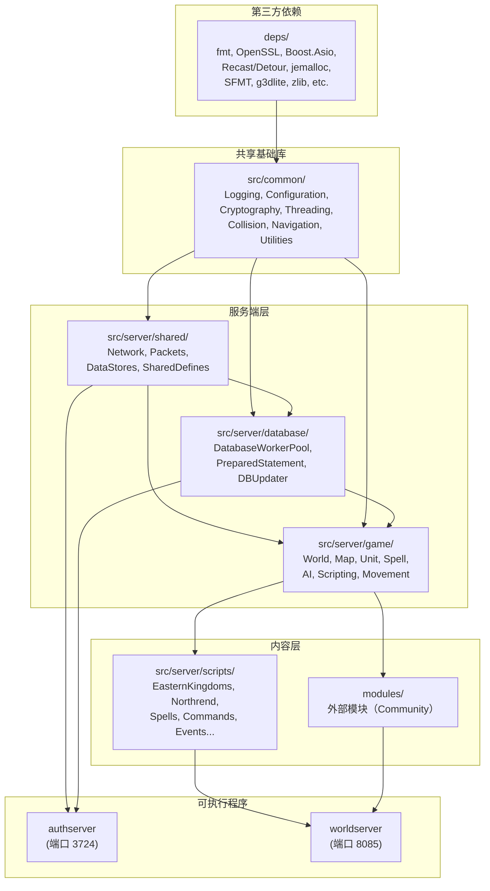
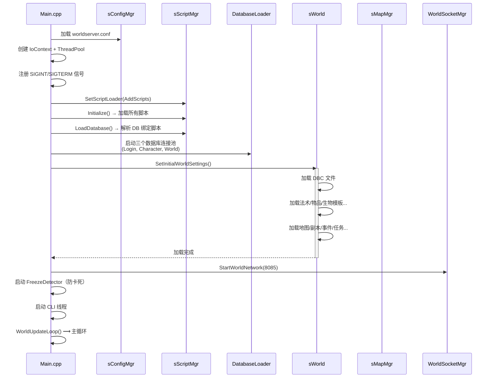
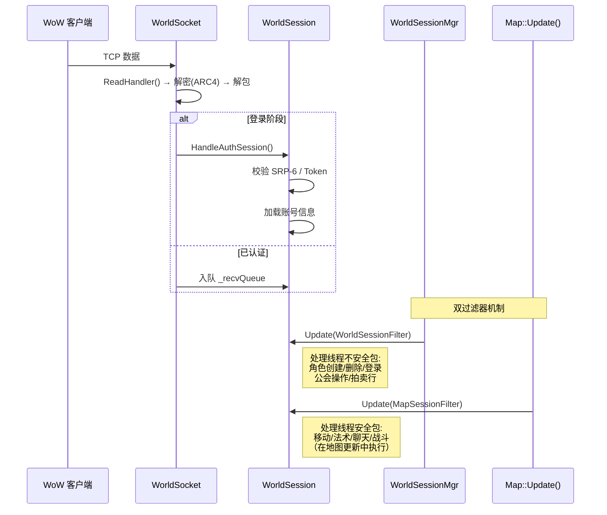

# AzerothCore 架构文档 (ds4)

> **版本**: 16.0.0-dev（CMake 项目版本 3.0.0）
> **上游**: MaNGOS → TrinityCore → SunwellCore（2016 年 fork）
> **许可协议**: GNU GPL v2

---

## 快速索引

- **[1. 项目概述](#1-项目概述)**
  - [1.1 技术栈](#11-技术栈)
  - [1.2 运行时架构概览](#12-运行时架构概览)
- **[2. 代码架构](#2-代码架构)**
  - [2.1 目录树](#21-目录树)
  - [2.2 模块划分与依赖关系](#22-模块划分与依赖关系)
  - [2.3 核心执行流程](#23-核心执行流程)
- **[3. 技术亮点](#3-技术亮点)**
  - [3.1 分层脚本钩子系统](#31-分层脚本钩子系统script-hooks)
  - [3.2 SmartAI 数据驱动](#32-smartai--数据驱动的生物行为系统)
  - [3.3 地图网格与并行更新](#33-地图网格系统与并行更新)
  - [3.4 异步数据库回调](#34-异步数据库与游戏主线程回调)
  - [3.5 类型安全预准备语句](#35-类型安全的预准备语句系统)
  - [3.6 移动系统](#36-移动系统--motionmaster--spline--navmesh)
- **[4. 各平台构建方式](#4-各平台构建方式)**
  - [4.1 前置要求](#41-前置要求)
  - [4.2 Linux](#42-linux)
  - [4.3 macOS](#43-macos)
  - [4.4 Windows (MSVC)](#44-windows-msvc-2022)
  - [4.5 Docker 一键部署](#45-docker一键部署)
  - [4.6 Nix Flake](#46-nix-flake实验性可复现构建)
- **[5. 总结与延伸](#5-总结与延伸)**
  - [5.1 设计理念](#51-设计理念)
  - [5.2 当前状态](#52-当前状态)
  - [5.3 扩展点](#53-扩展点)
  - [5.4 核心文件速查](#54-核心文件速查)

---

## 1. 项目概述

AzerothCore 是一个开源的 MMORPG 服务端模拟器，用于模拟《魔兽世界：巫妖王之怒》（3.3.5a 版本）的游戏逻辑，使玩家可以自行搭建并运行私人服务器。

**核心设计理念**：稳定性优先、暴雪-like 内容还原、模块化可扩展、社区驱动。

### 1.1 技术栈

| 层级 | 技术选型 |
|------|----------|
| **语言标准** | C++20（GCC / Clang / MSVC） |
| **构建系统** | CMake 3.16 ~ 3.22（强制 out-of-source 构建） |
| **数据库** | MySQL 8.4（MariaDB 兼容），三库分离：`acore_auth`、`acore_characters`、`acore_world` |
| **网络层** | Boost.Asio（TCP，epoll/kqueue/IOCP 抽象） |
| **密码学** | OpenSSL（SRP-6 认证、ARC4 加密、SHA/HMAC、Argon2 密码哈希、TOTP） |
| **字符串格式化** | fmt 12.1.0（`{}` 占位符，类型安全） |
| **路径寻路** | Recast/Detour（NavMesh 构建 + 寻路） |
| **碰撞检测** | 自研 BIH（Bounding Interval Hierarchy）+ VMap/MMap |
| **内存分配** | jemalloc 5.2.1（可选，替代 glibc malloc） |
| **压缩** | zlib 1.3.1、bzip2 1.0.6 |
| **随机数** | SFMT 1.5（SIMD 优化的 Mersenne Twister） |
| **测试** | Google Test（可选，`-DBUILD_TESTING=ON`） |
| **配置解析** | 自研 ConfigMgr（`name = value` 格式，支持模块配置合并） |
| **YAML 解析** | fkYAML（header-only） |
| **SOAP** | gSOAP 2.8.105（远程管理接口） |

### 1.2 运行时架构概览

```
┌──────────────┐    TCP/3724     ┌─────────────┐
│  WoW Client  │ ──────────────→ │  authserver  │ ←── acore_auth (账号/令牌/IP封禁)
└──────────────┘                 └──────┬───────┘
       │                               │ 返回 Realmlist
       │  TCP/8085                     ▼
       └─────────────────────── ┌─────────────┐
                                │  worldserver │
                                └──────┬───────┘
                                       │
                         ┌─────────────┼─────────────┐
                         ▼             ▼             ▼
                   acore_auth   acore_characters  acore_world
                   (账号信息)   (角色/背包/公会)  (静态游戏数据)
```

- **authserver**（认证服，端口 3724）：单线程 Asio 事件循环。处理登录认证（SRP-6），返回可用 Realm 列表。仅依赖 `acore_auth` 数据库。
- **worldserver**（世界服，端口 8085）：多线程架构。负责全部游戏逻辑 —— 地图更新、AI 驱动、法术结算、战斗、网络 I/O。

---

## 2. 代码架构

### 2.1 目录树

```
azerothcore-wotlk/
├── CMakeLists.txt                  # 根构建文件（项目版本 3.0.0，C++20）
├── acore.json                      # 应用元数据（版本号 16.0.0-dev）
├── acore.sh / install.sh           # CLI 入口脚本（构建/安装/管理）
├── PreLoad.cmake                   # CMake 预加载模块
│
├── src/                            # === C++ 源码 ===
│   ├── cmake/                      #   CMake 宏（ac_macros.cmake、GoogleTest 自动获取等）
│   ├── CMakeLists.txt              #   添加 genrev/、server/、tools/ 子目录
│   │
│   ├── common/                     #   【共享基础库】网络/配置/日志/加密/碰撞/寻路/工具
│   │   ├── Asio/                   #     Boost.Asio 封装 (IoContext, Strand)
│   │   ├── Collision/              #     碰撞检测（VMap Mgr, MMap Mgr, BIH 树）
│   │   ├── Configuration/          #     ConfigMgr 配置读取器
│   │   ├── Cryptography/           #     OpenSSL 封装 (SRP-6, ARC4, SHA, HMAC, Argon2)
│   │   ├── DataStores/             #     DBC 文件读取与存储
│   │   ├── Debugging/              #     崩溃处理（WheatyExceptionReport）
│   │   ├── Dynamic/                #     动态库加载
│   │   ├── IPLocation/             #     GeoIP 查库
│   │   ├── Logging/                #     Log4j 式日志框架（LOG_INFO/ERROR/DEBUG/TRACE）
│   │   ├── Metric/                 #     InfluxDB/Grafana 遥测指标
│   │   ├── Navigation/             #     Recast/Detour 寻路集成
│   │   ├── Platform/               #     平台特定代码（Windows 服务等）
│   │   ├── PrecompiledHeaders/     #     预编译头设置
│   │   ├── Threading/              #     线程池、生产者-消费者队列、MPSC 无锁队列
│   │   └── Utilities/             #     Random, StringFormat, Timer, EventMap, TaskScheduler
│   │
│   ├── genrev/                     #   Git Revision 生成器（编译期注入 commit SHA）
│   │
│   ├── server/                     #   === 服务端 ===
│   │   ├── apps/                   #     入口点
│   │   │   ├── authserver/         #       认证服 Main.cpp（单线程 Asio）
│   │   │   └── worldserver/        #       世界服 Main.cpp（多线程，含 WorldUpdateLoop）
│   │   ├── database/               #     【数据库层】
│   │   │   ├── Database/           #       DatabaseWorkerPool、PreparedStatement
│   │   │   ├── Logging/            #       SQL 日志
│   │   │   └── Updater/            #       DBUpdater（自动应用 pending SQL 更新）
│   │   ├── game/                   #     【核心游戏引擎】（~50 个子模块）
│   │   │   ├── AI/                 #       AI 系统（SmartAI, CreatureAI, EventMap, TaskScheduler）
│   │   │   ├── Entities/           #       实体系统（Unit, Player, Creature, GameObject, Item, Pet）
│   │   │   ├── Spells/             #       法术系统（Spell, Aura, SpellMgr, SpellScript）
│   │   │   ├── Maps/               #       地图/副本管理（Map, MapMgr, MapUpdater）
│   │   │   ├── Movement/           #       移动系统（MotionMaster, Spline, MovementGenerators）
│   │   │   ├── Battlegrounds/      #       战场
│   │   │   ├── Combat/             #       战斗/仇恨
│   │   │   ├── Groups/             #       队伍/团队
│   │   │   ├── Guilds/             #       公会
│   │   │   ├── Quests/             #       任务
│   │   │   ├── Loot/               #       掉落
│   │   │   ├── Achievements/       #       成就
│   │   │   ├── Chat/               #       聊天频道/命令
│   │   │   ├── Handlers/           #       Opcode 处理器（auth/chat/combat/movement/trade...）
│   │   │   ├── Scripting/          #       脚本钩子系统（ScriptMgr + ScriptDefines/）
│   │   │   ├── Server/             #       网络会话（WorldSocket, WorldSession, WorldSessionMgr）
│   │   │   └── World/              #       世界管理器（World 类，主循环）
│   │   ├── scripts/                #     【内容脚本】按地域和领域组织
│   │   │   ├── Commands/           #       GM 命令
│   │   │   ├── Custom/             #       用户自定义脚本（gitignore）
│   │   │   ├── EasternKingdoms/    #       东部王国（~170 个副本/野外脚本）
│   │   │   ├── Kalimdor/           #       卡利姆多
│   │   │   ├── Northrend/          #       诺森德
│   │   │   ├── Outland/            #       外域
│   │   │   ├── Events/             #       世界事件
│   │   │   ├── OutdoorPvP/         #       野外 PvP
│   │   │   ├── Pet/                #       宠物
│   │   │   ├── Spells/             #       职业技能脚本
│   │   │   └── World/              #       全局脚本（世界 BOSS、NPC、物品...）
│   │   └── shared/                 #     auth + world 共享代码（网络基类、数据模板、定义）
│   │
│   ├── test/                       #   Google Test 单元测试 + Mock
│   └── tools/                      #   地图/DBC 提取工具
│
├── deps/                           # 【第三方依赖】（21 个 vendored 库）
│   ├── argon2/                     #   Argon2 密码哈希
│   ├── fmt/                        #   fmtlib 12.1.0（字符串格式化）
│   ├── g3dlite/                    #   3D 数学库
│   ├── gsoap/                      #   SOAP/XML (远程管理)
│   ├── jemalloc/                   #   内存分配器
│   ├── libmpq/                     #   MPQ 文件读取
│   ├── recastnavigation/           #   NavMesh 寻路
│   ├── SFMT/                       #   SIMD 随机数
│   └── utf8cpp/                    #   UTF-8 处理
│
├── modules/                        # 【外部模块系统】（CMake 构建集成）
│   ├── CMakeLists.txt              #   模块编译编排（static/dynamic 链接）
│   ├── create_module.sh            #   模块模板生成器
│   └── how_to_make_a_module.md     #   开发者指南
│
├── conf/dist/                      # 【配置模板】（构建 & 运行时）
│   ├── config.cmake                #   CMake 构建选项
│   ├── config.sh                   #   Shell 层编译器配置
│   ├── env.ac                      #   运行时环境默认值
│   └── env.docker                  #   Docker 环境模板
│
├── data/sql/                       # 【SQL 数据】
│   ├── base/                       #   基础 Schema（不可修改）
│   ├── updates/db_*/               #   已合并的增量更新
│   ├── pending_db_*/               #   待合并更新（开发者在此编辑）
│   └── custom/                     #   自定义 SQL（gitignore）
│
├── apps/                           # 【辅助工具】
│   ├── codestyle/                  #   代码风格检查器（C++ & SQL）
│   ├── docker/                     #   Docker 编排
│   ├── installer/                  #   安装器脚本（acore.sh 后端）
│   ├── ci/                         #   CI 辅助脚本
│   └── config-merger/              #   配置文件合并工具
│
├── bin/                            # CLI 入口命令
├── doc/                            # 内部文档（Logging.md、ConfigPolicy.md）
├── docker-compose.yml              # Docker 全栈部署
├── flake.nix / flake.lock          # Nix flake（可复现构建）
└── .github/                        # GitHub CI/CD（Linux/Windows/macOS/Docker 构建矩阵）
```

### 2.2 模块划分与依赖关系



**依赖说明**：

| 层级 | 职责 | 关键符号/头文件 |
|------|------|----------------|
| `deps/` | 第三方库供给 | 编译前构建，输出静态库或 header-only |
| `src/common/` | 平台无关的基础设施 | `Acore::Crypto::SHA1`、`sLog`、`sConfigMgr`、`EventMap`、`TaskScheduler` |
| `src/server/shared/` | auth + world 共享的网络/数据结构 | `WorldPacket`、`OpcodeTable`、`DBCStorage` |
| `src/server/database/` | 数据库抽象与迁移 | `DatabaseWorkerPool<T>`、`PreparedStatement<T>`、`DBUpdater<T>` |
| `src/server/game/` | 核心游戏逻辑 | `sWorld`、`sMapMgr`、`sScriptMgr`、`Spell`、`Aura`、`CreatureAI` |
| `src/server/scripts/` | 具体游戏内容 | 每个副本/BOSS/职业技能独立 .cpp 文件 |
| `modules/` | 外部社区扩展 | 与 `src/server/scripts/` 平行的编译单元 |
| `src/server/apps/` | 程序入口 | `main()` → 初始化 → 运行循环 |

### 2.3 核心执行流程

#### 2.3.1 worldserver 启动序列



#### 2.3.2 主游戏循环（WorldUpdateLoop）

```
while (!World::IsStopped())
  │
  ├─ 帧率控制: 若 elapsed < MinWorldUpdateTime(1ms)，sleep 补帧
  │
  └─ sWorld->Update(diff)
       │
       ├─ _UpdateGameTime()            # 推进游戏时间
       ├─ Timers 更新                  # 9 个 IntervalTimer
       ├─ 过期封禁清理                  # 每 5 秒
       ├─ Who 列表刷新
       ├─ 每日/每周任务重置检查
       ├─ 拍卖行到期物品处理
       ├─ 邮件清理                      # 每 6 小时
       ├─ sWorldSessionMgr->UpdateSessions()  # 处理玩家会话
       ├─ 日志清理
       ├─ sLFGMgr->Update(diff, 0)     # LFG 预处理
       │
       ├─ sMapMgr->Update(diff)        # ★ 核心：所有地图更新
       │   │
       │   │ 步进轮转（step 0→1→2→3）:
       │   │
       │   │ step 0: 大陆地图全量 Update
       │   │ step 1: 战场/竞技场全量 Update
       │   │ step 2: 副本/团队全量 Update
       │   │ step 3: 冷却周期（所有地图均已处理完毕）
       │   │
       │   └─ Map::Update(accum, diff)
       │       ├─ Creature AI 驱动（SmartAI/ScriptedAI）
       │       ├─ 法术/Aura 计时更新
       │       ├─ 网格可见性更新 → SendObjectUpdates()
       │       ├─ 移动路径更新（Spline）
       │       ├─ 重生队列处理
       │       └─ MapSessionFilter 处理玩家包
       │
       ├─ sBattlegroundMgr->Update()    # 战场状态机
       ├─ sOutdoorPvPMgr->Update()      # 野外 PvP
       ├─ sLFGMgr->Update(diff, 2)      # LFG 后处理
       ├─ ProcessQueryCallbacks()        # ★ 异步 DB 回调执行
       ├─ sGameEventMgr->Update()        # 游戏事件触发
       ├─ ProcessCliCommands()           # 控制台命令
       └─ sScriptMgr->OnWorldUpdate()    # 模块钩子
```

#### 2.3.3 网络包处理路径



---

## 3. 技术亮点

### 3.1 分层脚本钩子系统（Script Hooks）

**痛点**：MMORPG 服务端有数百种游戏事件需要在不同层级定制行为，需要一个安全、高性能、可扩展的钩子机制。

**实现**（`src/server/game/Scripting/`）：

```cpp
// ScriptMgr.h —— 核心调度器
class ScriptMgr {
    // 每个钩子类型一个公开方法
    void OnPlayerLogin(Player* player);
    void OnCreatureUpdate(Creature* creature, uint32 diff);
    CreatureAI* GetCreatureAI(Creature* creature);
    bool OnGossipHello(Player* player, Creature* creature);
    void OnWorldUpdate(uint32 diff);
    // ... 总计 200+ 钩子方法
};
```

**ScriptRegistry<TScript>** 使用三个内部数据结构实现 O(1) 分发：

- `ScriptPointerList`（`map<uint32, TScript*>`）：按 DB 脚本 ID 索引
- `ALScripts`：待 DB 解析的"after-load"脚本
- `EnabledHooks`（`vector<vector<TScript*>>`）：按钩子枚举值索引，只遍历订阅了该钩子的脚本

**注册方式**（`src/server/game/Scripting/ScriptDefines/` 下 98 个钩子定义文件）：

```cpp
// 代码级钩子（PlayerScript）
new PlayerScript("my_module_login", { PLAYERHOOK_ON_LOGIN });

// DB 绑定脚本（CreatureAI）
RegisterCreatureAI(boss_firemaw);

// 法术脚本
RegisterSpellScript(spell_mage_pyroblast);
```

**设计价值**：
- 钩子分发 O(1)：只迭代启用该钩子的脚本，而非全部
- DB 绑定延迟解析：脚本在 DB 加载后才匹配 `creature_template.ScriptName`
- 布尔返回钩子可阻止默认行为（如 `OnBeforeTeleport` 返回 `false` 阻止传送）
- 98 个钩子类型覆盖从玩家操作到世界事件的全部触点

### 3.2 SmartAI —— 数据驱动的生物行为系统

**痛点**：每个生物行为如果需要 C++ 代码编写，几千种生物将产生不可维护的代码量。需要一个 DB 可配置的行为引擎。

**实现**（`src/server/game/AI/SmartScripts/`）：

SmartAI 通过 `smart_scripts` 数据库表描述生物行为，核心架构：

```
事件 (SMART_EVENT) → 条件检查 (sConditionMgr) → 动作 (SMART_ACTION)
```

**80+ 事件类型**（`SmartScriptMgr.h:97-202`）：

| 事件枚举 | 触发时机 |
|----------|---------|
| `UPDATE_IC` | 战斗中的周期 Tick |
| `UPDATE_OOC` | 非战斗周期 Tick |
| `HEALTH_PCT` | HP 达到百分比阈值 |
| `AGGRO` | 进入战斗 |
| `SPELLHIT` | 被法术命中 |
| `AI_INIT` | AI 初始化 |
| `EVENT_PHASE_CHANGE` | 阶段切换 |
| `RANGE` | 目标进入某距离范围 |
| `GOSSIP_HELLO` | 对话打开 |

**130+ 动作类型**（`SmartScriptMgr.h:540-699`）：

| 动作 | 效果 |
|------|------|
| `TALK` | 播放生物文本 |
| `CAST` | 向目标施法 |
| `SUMMON_CREATURE` | 召唤生物 |
| `SET_EVENT_PHASE` | 切换到新阶段 |
| `CALL_TIMED_ACTIONLIST` | 执行定时动作子列表 |
| `ESCORT_START` | 开始路径巡逻 |

**阶段系统**（12 阶段位掩码）：
```
Phase 1 (bit 0):  普通阶段
Phase 2 (bit 1):  50% HP 狂暴阶段
Phase 3 (bit 2):  25% HP 终极阶段
...
```

事件通过 `event_phase_mask` 控制哪些阶段可触发，动作通过 `SET_EVENT_PHASE` 切换阶段，纯 DB 配置即可实现复杂的多阶段 BOSS 战。

**SmartAI::UpdateAI() 每 Tick 流程**（`SmartAI.cpp`）：

```cpp
void SmartAI::UpdateAI(uint32 diff) {
    CheckConditions(diff);       // 载具条件
    UpdateVictim();              // 威胁管理
    GetScript()->OnUpdate(diff); // SmartScript 引擎 → 计时器推进 → 事件匹配 → 动作执行
    UpdatePath(diff);            // 路径巡逻
    UpdateDespawn(diff);         // 定时消失
    UpdateFollow(diff);          // 跟随行为
    DoMeleeAttackIfReady();      // 自动攻击
}
```

### 3.3 地图网格系统与并行更新

**痛点**：WoW 地图最大 34133×34133 世界单位，含数千活跃实体。需要高效的空间索引和分步更新策略以维持稳定的 Tick 率。

**网格划分**（`src/common/Collision/Maps/MapDefines.h:24-26`）：

| 层级 | 尺寸 | 说明 |
|------|------|------|
| 地图 | 64×64 网格（4096 个网格） | 每个网格 533.33 世界单位 |
| 网格 | 8×8 格（64 格） | TOT 262,144 格整张地图 |
| 格 | 存储实体引用 | Player, Creature, GameObject, DynamicObject, Corpse |

**按步轮转更新**（`src/server/game/Maps/MapMgr.cpp:250`）：

```
┌─────────────────────────────────────────────────┐
│ i_timer[0]    i_timer[1]    i_timer[2]    i_timer[3] │
│   大陆全量      战场全量      副本全量        冷却周期     │
│     ↑           ↑           ↑           ↑         │
│  step 0  →  step 1  →  step 2  →  step 3  →  step 0 │
└─────────────────────────────────────────────────┘

每步仅部分地图类型获得全量 diff 更新，
其余类型仅处理 0-diff "不推进时间"的更新。
```

**MapUpdater 多线程并行**（可选启用）：

```cpp
// MapUpdater.h —— 线程池并行地图更新
m_updater.schedule_update(map);  // 调度到工作线程
m_updater.wait();                // 等待所有地图完成
```

**Map 类内部核心数据结构**（`src/server/game/Maps/Map.h:588-696`）：

| 成员 | 用途 |
|------|------|
| `MapGridManager _mapGridManager` | 64×64 网格数组 |
| `MapRefMgr m_mapRefMgr` | 玩家引用链表 |
| `MapCollisionData _mapCollisionData` | 动态 BIH 碰撞树 |
| `respawnQueue` | 优先级重生队列 |
| `UpdatableObjectList _updatableObjectList` | 需要每 Tick 检查范围的实体 |
| `_updateObjects`（unordered_set） | 有定时更新的实体 |
| `marked_cells`（bitset） | 优化的格访问追踪 |

### 3.4 异步数据库与游戏主线程回调

**痛点**：同步数据库查询会卡住游戏 Tick，但异步查询的结果必须在游戏线程安全处理。

**实现**（`src/server/database/Database/DatabaseWorkerPool.h`）：

```
┌────────────────┐    ProducerConsumerQueue<SQLOperation*>    ┌────────────────┐
│   游戏主线程     │ ──────────────→ Enqueue ──────────────→  │   DB 工作线程   │
│                │ ←─────── future + QueryCallback ────────  │                │
│  World::Update()│                                           │  MySQL 执行    │
│      │         │                                           │                │
│      └─ ProcessQueryCallbacks()                            │                │
│         → InvokeIfReady() → 游戏线程安全执行回调              │                │
└────────────────┘                                           └────────────────┘
```

**`QueryCallback`** 桥梁（`src/server/database/Database/QueryCallback.h`）：

```cpp
class QueryCallback {
    std::variant<QueryResultFuture, PreparedQueryResultFuture> _future;
    std::queue<QueryCallbackData> _callbacks; // 链式回调

    bool InvokeIfReady(); // 检查 std::future 是否就绪，就绪则回调
};
```

**实际使用**（`src/server/game/Handlers/CharacterHandler.cpp`）：

```cpp
_queryProcessor.AddCallback(
    CharacterDatabase.AsyncQuery(stmt).WithPreparedCallback(
        std::bind(&WorldSession::HandleCharEnum, this, std::placeholders::_1)
    )
);
```

`QueryCallbackProcessor` 散落在 `World::_queryProcessor`（全局）、`WorldSession::_queryProcessor`（每个玩家会话）和 `WorldSocket::_queryProcessor`（登录阶段），在各自的更新周期中轮询就绪的回调。

### 3.5 类型安全的预准备语句系统

**痛点**：SQL 注入风险和运行时类型错误是数据库交互的常见问题。需要编译期保证参数类型正确。

**实现**（`src/server/database/Database/PreparedStatement.h`）：

```cpp
// 参数存储 —— std::variant 自动处理类型
using PreparedStatementData = std::variant<
    bool, uint8, uint16, uint32, uint64,
    int8, int16, int32, int64,
    float, double, std::string, std::vector<uint8>, std::nullptr_t
>;

template<typename T>
class PreparedStatement {
    // SFINAE 模板，自动转换：
    // - 数值类型 → 底层类型
    // - 枚举 → 底层整数
    // - string_view → std::string
    // - chrono::duration → uint32（除非手动禁用）
    template<typename U> void SetData(uint8 index, U value);

    // 可变参数便捷设置
    template<typename... Args> void SetArguments(Args&&... args);
};
```

**使用示例**：
```cpp
auto* stmt = CharacterDatabase.GetPreparedStatement(CHAR_SEL_CHARACTER);
stmt->SetData(0, guid);      // uint64
stmt->SetData(1, std::chrono::seconds(30)); // 自动转为 uint32
stmt->SetData(2, "realm1_"); // std::string
CharacterDatabase.AsyncQuery(stmt).WithPreparedCallback(/*...*/);
```

数据库连接池（`DatabaseWorkerPool<T>`）自动管理 Prepared Statement 的创建、执行和内存回收。

### 3.6 移动系统 —— MotionMaster + Spline + NavMesh

**痛点**：WoW 的移动不是简单的直线 A→B。它是平滑曲线（Catmull-Rom 样条）、多种移动模式（追逐/跟随/巡逻/跳跃）、碰撞检测和寻路的三维问题。

**三层架构**：

```
┌──────────────────────────────────────────────┐
│ MotionMaster (src/server/game/Movement/)      │
│   │ 槽位栈（3 槽）：Idle / Active / Controlled │
│   │ 20 种 MovementGenerator 类型               │
│   ├── HomeMovementGenerator (回家)            │
│   ├── RandomMovementGenerator (随机游荡)       │
│   ├── ChaseMovementGenerator (追逐目标)        │
│   ├── FleeingMovementGenerator (逃离)          │
│   ├── PointMovementGenerator (移动到点)        │
│   ├── WaypointMovementGenerator (路径巡逻)     │
│   ├── FormationMovementGenerator (编队)        │
│   └── ... (共 20 种)                         │
│                                               │
│   每个 Generator 调用 PathGenerator 计算路径   │
└───────────────────┬──────────────────────────┘
                    │
┌───────────────────▼──────────────────────────┐
│ PathGenerator (MovementGenerators/)           │
│   │ 桥接 MMapMgr (dtNavMeshQuery)              │
│   │ BuildPolyPath() → 多边形走廊               │
│   │ BuildPointPath() → 平滑路径 (String Pull)  │
│   │ 回退: BuildShortcut() → 直线射线           │
│   │ 最长路径: 74 点                             │
└───────────────────┬──────────────────────────┘
                    │
┌───────────────────▼──────────────────────────┐
│ Spline System (Movement/Spline/)              │
│   │ MoveSpline<MySpline>                      │
│   │ 三种评估模式: Linear / CatmullRom / Bezier │
│   │ 抛物线 (跳跃) 和自由落体 (坠落) 高程计算     │
│   │ velocity + facing + animation flags       │
│   │ 输出: SMSG_MONSTER_MOVE / MOVE_SPLINE_*   │
└──────────────────────────────────────────────┘
```

**碰撞检测管线**（`src/common/Collision/`）：

| 层级 | 文件 | 数据 |
|------|------|------|
| VMap 树 | `VMapMgr2` + `StaticMapTree` | `.vmtree` 静态世界几何 BSP 树 |
| MMap NavMesh | `MMapMgr` | `.mmap` + `.mmtile` Recast/Detour NavMesh |
| 动态树 | `DynamicMapTree` | `GameObjectModel`（门、宝箱等动态物体） |
| BIH 加速 | `BoundingIntervalHierarchy` | 统一的 Ray-Triangle 加速结构 |

---

## 4. 各平台构建方式

### 4.1 前置要求

| 依赖 | Linux (Ubuntu/Debian) | macOS | Windows |
|------|----------------------|-------|---------|
| **编译器** | GCC 11+ / Clang 15+ | Apple Clang (Xcode 15+) | MSVC 2022 |
| **CMake** | ≥ 3.16 | ≥ 3.16 | ≥ 3.16 |
| **MySQL/MariaDB** | `libmysqlclient-dev` / `libmariadb-dev` | `mysql-client` (Homebrew) | MySQL 8.x |
| **Boost** | `libboost-all-dev` | `boost` (Homebrew) | 通过 vcpkg 或自行编译 |
| **OpenSSL** | `libssl-dev` | 系统自带 | 通过 vcpkg 或自行安装 |
| **其他** | `libbz2-dev`, `libreadline-dev`, `zlib1g-dev`, `libncurses5-dev` | `readline`, `bzip2`, `zlib` (Homebrew) | 通过 vcpkg |
| **构建加速** | `ccache`（推荐）| `ccache`（推荐）| 使用 MSVC 增量链接 |
| **Docker** | Docker + Docker Compose (可选，直接启动) | Docker Desktop | Docker Desktop |

### 4.2 Linux

```bash
# 1. 安装系统依赖
sudo apt update
sudo apt install -y git cmake make gcc g++ clang ccache \
    libboost-all-dev libmysqlclient-dev \
    libssl-dev libbz2-dev libreadline-dev \
    libncurses5-dev zlib1g-dev

# 2. 克隆仓库
git clone https://github.com/azerothcore/azerothcore-wotlk.git
cd azerothcore-wotlk

# 3. 配置构建 (ccache 加速，RelWithDebInfo 优化+调试符号)
mkdir build && cd build
cmake .. \
    -DCMAKE_C_COMPILER=clang \
    -DCMAKE_CXX_COMPILER=clang++ \
    -DCMAKE_INSTALL_PREFIX=$HOME/azeroth-server \
    -DCMAKE_BUILD_TYPE=RelWithDebInfo \
    -DSCRIPTS=static \
    -DMODULES=static \
    -DCMAKE_CXX_COMPILER_LAUNCHER=ccache \
    -DCMAKE_C_COMPILER_LAUNCHER=ccache

# 4. 编译（$(nproc) = 自动检测 CPU 核心数）
make -j$(nproc)

# 5. 安装
make install
```

**关键 CMake 选项说明**：

| 选项 | 默认值 | 说明 |
|------|--------|------|
| `SCRIPTS` | `static` | 脚本链接方式：`static`（单文件）、`dynamic`（动态库）、`none`、`minimal-*` |
| `MODULES` | `static` | 模块链接方式：`static`、`dynamic`、`none` |
| `APPS_BUILD` | `all` | 构建目标：`all`、`auth-only`、`world-only`、`none` |
| `TOOLS_BUILD` | `none` | 地图提取工具：`none`、`all`、`db-only`、`maps-only` |
| `BUILD_TESTING` | `OFF` | 启用 Google Test 单元测试 |
| `USE_SCRIPTPCH` | `ON` | 脚本预编译头 |
| `USE_COREPCH` | `ON` | 核心预编译头 |
| `WITH_WARNINGS` | `OFF` | 显示所有编译警告 |
| `WITH_COREDEBUG` | `OFF` | 启用核心调试代码 |
| `WITH_PERFTOOLS` | `OFF` | gperftools 性能分析 |
| `WITH_DYNAMIC_LINKING` | `OFF` | 动态库链接 |
| `WITHOUT_METRICS` | `OFF` | 禁用 InfluxDB/Grafana 指标 |
| `DISABLED_AC_MODULES` | - | 排除的模块列表（分号分隔） |

### 4.3 macOS

```bash
# 1. 安装 Homebrew 依赖
brew install cmake mysql boost openssl readline bzip2 zlib ccache

# 2. 克隆仓库
git clone https://github.com/azerothcore/azerothcore-wotlk.git
cd azerothcore-wotlk

# 3. 配置构建（Apple Silicon 和 Intel 均使用 Apple Clang）
mkdir build && cd build
cmake .. \
    -DCMAKE_INSTALL_PREFIX=$HOME/azeroth-server \
    -DCMAKE_BUILD_TYPE=RelWithDebInfo \
    -DSCRIPTS=static \
    -DMODULES=static \
    -DOPENSSL_ROOT_DIR=$(brew --prefix openssl) \
    -DREADLINE_ROOT_DIR=$(brew --prefix readline)

# 4. 编译
make -j$(sysctl -n hw.ncpu)

# 5. 安装
make install

# 或使用一键脚本
# source ./acore.sh install-deps  &&  source ./apps/ci/mac/ci-compile.sh
```

### 4.4 Windows (MSVC 2022)

```powershell
# 1. 安装 vcpkg（若尚未安装）
git clone https://github.com/Microsoft/vcpkg.git
.\vcpkg\bootstrap-vcpkg.bat
.\vcpkg\vcpkg.exe install boost openssl mysql-connector-cpp

# 2. 使用 CMake GUI 或命令行
mkdir build && cd build
cmake .. ^
    -G "Visual Studio 17 2022" ^
    -DCMAKE_INSTALL_PREFIX=C:\azeroth-server ^
    -DSCRIPTS=static ^
    -DMODULES=static ^
    -DCMAKE_TOOLCHAIN_FILE=C:\path\to\vcpkg\scripts\buildsystems\vcpkg.cmake

# 3. 编译（或使用 Visual Studio 打开生成的 .sln）
cmake --build . --config RelWithDebInfo --parallel
cmake --install . --config RelWithDebInfo
```

### 4.5 Docker（一键部署）

```bash
# 克隆并启动所有服务
git clone https://github.com/azerothcore/azerothcore-wotlk.git
cd azerothcore-wotlk
docker compose up -d
```

**Docker 服务拓扑**：

| 服务 | 端口 | 说明 |
|------|------|------|
| `ac-database` | 3306 | MySQL 8.4 |
| `ac-db-import` | - | 一次性 SQL 导入器（启动后退出） |
| `ac-worldserver` | 8085 (客户端), 7878 (SOAP) | 世界服 |
| `ac-authserver` | 3724 | 认证服 |
| `ac-client-data-init` | - | 初始化客户端数据卷（DBC/地图文件） |
| `ac-tools` | - | 地图提取工具（profile: `tools`） |
| `ac-dev-server` | 3724, 8085, 7878 | 开发服务器（bind-mount 源码，profile: `dev`） |

### 4.6 Nix Flake（实验性，可复现构建）

```bash
nix develop   # 进入开发 Shell（含全部依赖）
# 或
nix build     # 构建二进制文件
```

Nix Flake 配置在 `flake.nix` / `flake.lock`，保证跨机器完全一致的构建环境。

---

## 5. 总结与延伸

### 5.1 设计理念

AzerothCore 的设计围绕以下几个核心原则：

1. **稳定性优先**：每行代码都经过 CI 测试矩阵验证（Linux x4、macOS、Windows、Docker + 代码风格/SQL 风格检查器）。`FreezeDetector` 在主循环中加入卡死检测，确保服务不会静默挂起。

2. **分层解耦**：`deps/ → common/ → shared/ → database/ → game/ → scripts/ → modules/` 的严格依赖方向，使得每一层都可以独立测试和替换。

3. **数据驱动**：SmartAI 系统将大量生物行为从 C++ 代码下沉至 `smart_scripts` 数据库表，让非程序员也能创作游戏内容。Prepared Statement 系统将 SQL 参数类型检查提前到编译期。

4. **可扩展性**：ScriptMgr 的钩子系统（98 个钩子类型、200+ 方法）允许任何模块在不修改核心代码的情况下介入游戏逻辑。Module 系统支持静态/动态两种链接方式。

### 5.2 当前状态

- **版本**：16.0.0-dev（语义化版本），对应 WoW 3.3.5a（巫妖王之怒）
- **维护**：活跃的社区开发，每日有数十个 PR 合并
- **覆盖度**：核心游戏系统（法术、AI、移动、网络、数据库）成熟稳定；内容脚本覆盖大部分副本和职业法术

### 5.3 扩展点

| 扩展方式 | 适用场景 | 难度 |
|----------|---------|------|
| **SmartAI（smart_scripts 表）** | 修改生物行为、多阶段 BOSS 战 | 低 |
| **Script Hooks（PlayerScript 等）** | 自定义玩家登录/登出/升级等逻辑 | 中 |
| **CreatureScript + AI** | 需要复杂 C++ 逻辑的 BOSS（EventMap/TaskScheduler） | 中 |
| **SpellScript / AuraScript** | 修改法术效果、光环行为 | 中高 |
| **Module 系统** | 完整的功能扩展（如幻化、跨阵营） | 高 |

### 5.4 核心文件速查

| 组件 | 路径 | 关键类/函数 |
|------|------|-----------|
| 主循环 | `src/server/apps/worldserver/Main.cpp:557` | `WorldUpdateLoop()` |
| World::Update | `src/server/game/World/World.cpp:1099` | `sWorld->Update(diff)` |
| 地图更新 | `src/server/game/Maps/MapMgr.cpp:250` | `sMapMgr->Update(diff)` |
| Map 类 | `src/server/game/Maps/Map.h:165` | `Map`, `MapInstanced`, `InstanceMap` |
| 网络会话 | `src/server/game/Server/WorldSession.h:382` | `WorldSession` |
| 网络套接字 | `src/server/game/Server/WorldSocket.h:143` | `WorldSocket` (Boost.Asio) |
| 脚本调度器 | `src/server/game/Scripting/ScriptMgr.h:913` | `sScriptMgr` (单例) |
| SmartAI 引擎 | `src/server/game/AI/SmartScripts/SmartScript.h` | `SmartScript` |
| SmartAI 主类 | `src/server/game/AI/SmartScripts/SmartAI.h:45` | `SmartAI : CreatureAI` |
| 法术类 | `src/server/game/Spells/Spell.h:297` | `Spell` (准备→施放→结束 状态机) |
| 光环系统 | `src/server/game/Spells/Auras/SpellAuras.h:86` | `Aura`, `AuraEffect` |
| 法术管理器 | `src/server/game/Spells/SpellMgr.h:641` | `sSpellMgr` (静态数据注册表) |
| 移动控制器 | `src/server/game/Movement/MotionMaster.h` | `MotionMaster` (3 槽 + 20 种生成器) |
| 样条曲线 | `src/server/game/Movement/Spline/MoveSpline.h` | `MoveSpline` (CatmullRom + Parabolic) |
| 寻路生成器 | `src/server/game/Movement/MovementGenerators/PathGenerator.h` | `PathGenerator` (Recast/Detour 桥接) |
| 碰撞检测 | `src/common/Collision/Management/VMapMgr2.h` | `VMapMgr2` (BIH 树) |
| NavMesh | `src/common/Collision/Management/MMapMgr.h` | `MMapMgr` (dtNavMesh) |
| 数据库线程池 | `src/server/database/Database/DatabaseWorkerPool.h` | `DatabaseWorkerPool<T>` |
| 预准备语句 | `src/server/database/Database/PreparedStatement.h` | `PreparedStatement<T>` |
| Schema 更新器 | `src/server/database/Updater/DBUpdater.h` | `DBUpdater<T>` |
| 日志系统 | `src/common/Logging/Log.h:49` | `LOG_INFO`, `LOG_ERROR`, `sLog` |
| 事件调度器 | `src/common/Utilities/EventMap.h:286` | `EventMap` (ID 基准，阶段管控) |
| 任务调度器 | `src/common/Utilities/TaskScheduler.h:662` | `TaskScheduler` (Lambda 基准) |
| 配置管理器 | `src/common/Configuration/ConfigMgr.h` | `sConfigMgr` |
| 密码 SRP6 | `src/common/Cryptography/Authentication/SRP6.h` | `SRP6` (OpenSSL) |
| MPSC 队列 | `src/common/Threading/MPSCQueue.h` | `MPSCQueue` (无锁，多写单读) |

---

*文档生成日期：2026-05-27 | 基于仓库 `master` 分支最新代码分析*
