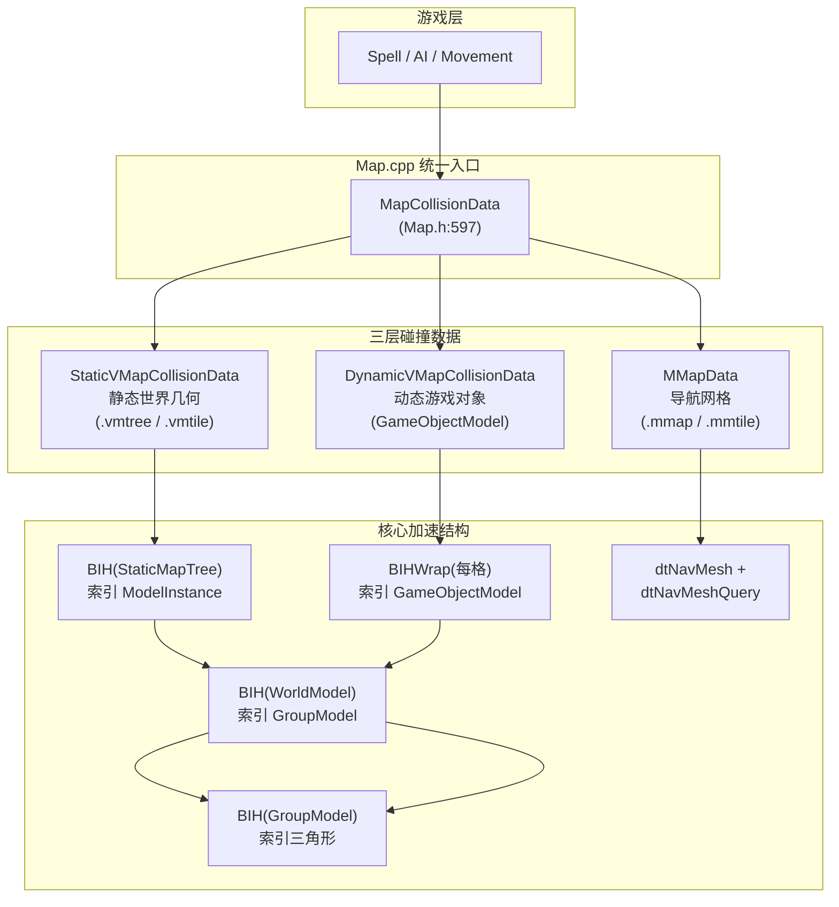

# AzerothCore 碰撞检测系统详解

> **相关文档**: [架构总览](./ARCHITECTURE.md)
> **分析日期**: 2026-05-27

---

## 快速索引

- **[1. 总体架构](#1-总体架构)**
- **[2. BIH 加速结构](#2-bih-加速结构--整个碰撞系统的核心引擎)**
  - [2.1 节点编码](#21-bih-节点编码)
  - [2.2 构建算法 (`subdivide`)](#22-bih-构建算法-subdivide)
  - [2.3 光线求交算法 (`intersectRay`)](#23-bih-光线求交算法-intersectray)
  - [2.4 点查询 (`intersectPoint`)](#24-bih-点查询-intersectpoint)
  - [2.5 BIH 的四个实例](#25-bih-的四个实例)
- **[3. VMap 层 — 静态世界几何](#3-vmap-层--静态世界几何碰撞)**
  - [3.1 数据加载路径](#31-数据加载路径)
  - [3.2 ModelInstance 空间变换](#32-modelinstance--空间变换层)
  - [3.3 WorldModel 内部分层](#33-worldmodel-内部分层)
  - [3.4 Möller-Trumbore 三角形求交](#34-möller-trumbore-三角形求交)
- **[4. DynamicMapTree — 动态游戏对象](#4-dynamicmaptree--动态游戏对象碰撞)**
  - [4.1 空间结构](#41-空间结构)
  - [4.2 插入/删除与延迟重建](#42-插入删除与延迟重建)
  - [4.3 光线遍历 — 3D DDA](#43-光线遍历--3d-dda-amanatides-woo-算法)
- **[5. MMap 层 — 导航网格](#5-mmap-层--recastdetour-导航网格)**
  - [5.1 数据加载](#51-数据加载)
  - [5.2 dtQueryFilterExt — 自定义代价过滤器](#52-dtqueryfilterext--自定义代价过滤器)
  - [5.3 路径计算流水线](#53-路径计算流水线)
  - [5.4 PathGenerator 在 Map.cpp 中的使用](#54-pathgenerator-在-mapcpp-中的使用)
- **[6. 完整查询流水线](#6-完整查询流水线汇总)**
  - [6.1 视线检测 `Map::isInLineOfSight()`](#61-视线检测-mapisinlineofsight)
  - [6.2 高度查询 `Map::GetHeight()`](#62-高度查询-mapgetheight)
  - [6.3 完整地形状态 `GetFullTerrainStatusForPosition()`](#63-完整地形状态-getfullterrainstatusforposition)
- **[7. 关键性能优化](#7-关键性能优化总结)**
- **[8. 核心文件索引](#8-核心文件索引)**

---

## 1. 总体架构

碰撞检测系统是一个**三层级联**架构，覆盖静态世界几何（VMap）、导航网格寻路（MMap）和动态游戏对象（DynamicMapTree），每一层内部又依赖 **BIH（Bounding Interval Hierarchy）** 加速结构实现亚线性查询。

```
游戏层 (Spell, AI, Movement)
  │
  ├── 视线检测 (isInLineOfSight)
  ├── 高度查询 (GetHeight)
  ├── 地形状态 (GetFullTerrainStatusForPosition)
  ├── 坐标校验 (CheckCollisionAndGetValidCoords)
  └── 路径寻路 (PathGenerator::CalculatePath)
        │
        ▼
  MapCollisionData (Map.h:597)  ←── 三层统一入口
        │
        ├── StaticVMapCollisionData → 静态世界几何 (建筑/地形)
        ├── DynamicVMapCollisionData → 动态游戏对象 (门/宝箱等)
        └── MMapData → Recast/Detour 导航网格 (寻路专用)
```



---

## 2. BIH 加速结构 — 整个碰撞系统的核心引擎

**文件**: `src/common/Collision/BoundingIntervalHierarchy.h` (430行), `.cpp` (302行)

BIH 是一个 **Bounding Interval Hierarchy**（有界区间层级），源于 Sunflow Java 光线追踪器，是碰撞检测中最重要的性能数据结构。整个碰撞系统中共出现 **4 层 BIH**。

### 2.1 BIH 节点编码

每个节点用 `uint32` 编码（`BoundingIntervalHierarchy.h:430`）：

```
Bits 31-30: 轴 (0=X, 1=Y, 2=Z, 3=叶节点)
Bit  29:    BVH2 紧凑节点标志
Bits 28-0:  子节点偏移 / 叶节点起始终点索引
```

- **内部节点** 占 3 个 `uint32`：`[编码头, planeFront(float), planeBack(float)]`
- **BVH2 节点**：两边都剪裁空空间的紧凑节点
- **叶节点**：`[编码头(axis=3), 基元数量]`，后跟 `n` 个基元索引

### 2.2 BIH 构建算法 (`subdivide`)

`BoundingIntervalHierarchy.cpp:41-271`

递归二分划分的核心流程：

1. **终止条件判定**：基元数 ≤ `maxPrims`(默认3) 或深度 ≥ 64 → 创建叶节点
2. **选轴**：取包围盒最长的轴向作分裂轴
3. **分裂面**：`split = 0.5 * (gridBox.lo[axis] + gridBox.hi[axis])` —— 中点
4. **就地分区**：以重心在分裂面左/右为标准，原地交换基元。同时追踪：
   - `clipL` —— 左侧基元的最大右边界
   - `clipR` —— 右侧基元的最小左边界
   - `nodeL`, `nodeR` —— 真实紧凑包围盒
5. **BVH2 优化**：若真实包围盒比节点包围盒小 30% 以上 → 创建 BVH2 节点（剪裁两侧空空间），立即递归
6. **全偏一侧处理**：若基元全部落入一侧 → 调整 `gridBox` 半宽重试；若卡住 → 创建叶节点
7. **空空间剪裁**：若上次分裂产生可见空空间 → 创建一方为空叶、一方为实际节点的子节点
8. **正常分裂**：写入内部节点编码头，递归左右子节点

```
示例：100个三角形，轴=X，分裂面=0.5
 ┌─────────────────────────────────────┐
 │████████║░░░░░░░░░░░░░░░░░░░░░░░░░░░░░│  gridBox [0, 1]
 │████████║░░...                      │
 │    clipL │ clipR               [1.0] │
 └─────────────────────────────────────┘
   左: 37个三角形   右: 63个三角形
   递归...         递归...
```

### 2.3 BIH 光线求交算法 (`intersectRay`)

`BoundingIntervalHierarchy.h:122-283`

这是整个碰撞系统**最高频调用的性能热点**。

**预处理**（125-181行）：

```cpp
// 1. 方向倒数（避免运行时除法）
invDir[i] = 1.0f / dir[i];

// 2. Slab 方法计算射线-包围盒区间 [intervalMin, intervalMax]
for each axis:
    t1 = (lo - org) * invDir, t2 = (hi - org) * invDir
    if t1 > t2: swap (处理负方向)
    intervalMin = max(intervalMin, t1)
    intervalMax = min(intervalMax, t2)
// 早退: intervalMax <= 0 (射线后方) 或 intervalMin >= maxDist

// 3. 遍历顺序偏移（方向符号→子节点先后）
offsetFront[i] = floatToRawIntBits(dir[i]) >> 31;  // 0=正方向, 1=反方向
offsetBack[i]  = offsetFront[i] ^ 1;
```

**迭代深度优先遍历**（固定 64 节点栈）：

对每个节点解码 `axis`：

- **叶节点**(axis=3)：遍历 `n` 个基元，回调 `intersectCallback(ray, primitive, maxDist, stopAtFirstHit)`
- **BVH2 节点**：将区间剪裁到 `[planeFront, planeBack]`，若退化为空则弹出栈
- **内部节点**(axis<3)：计算 `tf`(前平面交点) 和 `tb`(后平面交点)，分 4 种情况：

| 条件 | 行为 | 开销 |
|------|------|------|
| `tf < intervalMin && tb > intervalMax` | 射线从两个剪裁面之间穿过 → 跳过节点 | O(1) |
| `tf < intervalMin` | 仅穿越远面子节点，更新 `intervalMin = max(tb, intervalMin)` | 单递归 |
| `tb > intervalMax` | 仅穿越近面子节点，更新 `intervalMax = min(tf, intervalMax)` | 单递归 |
| 两个都相交 | 压入远节点到栈，降入近节点（`intervalMax` 被夹紧） | 栈操作 |

```
射线方向 →
      ┌─── planeFront ───┐  ┌─── planeBack ───┐
      │                  │  │                  │
  ██  │   空   ████████████│  │   空   ██
  ██  │        ████████████│  │        ██
      │  clipL     nodeL  │  │  nodeR    clipR │
      │        近面/左子    │  │       远面/右子  │
      └──────────────────┘  └──────────────────┘
  ray通过平面: tf         tb
  区间:  [intervalMin────────────────────intervalMax]
```

**核心优化**：使用 `continue` 替代栈推入，当射线仅穿过一个子节点时只做单分支，使大多数射线的遍历复杂度接近 **O(log n)**。

### 2.4 BIH 点查询 (`intersectPoint`)

`BoundingIntervalHierarchy.h:285-375`

用于 `GetLocationInfo` / `GetAreaAndLiquidData`。遍历内部节点时比较 `p[axis]` 与两个剪裁面：

- `tl < p[axis] && tr > p[axis]`：点在两平面之间 → 跳过节点
- `tr < p[axis]`：仅右侧
- `tl > p[axis]`：仅左侧
- 否则：压右、降左

### 2.5 BIH 的四个实例

| BIH 所在层 | 存储什么 | leafSize | 文件 |
|-----------|---------|----------|------|
| `StaticMapTree::iTree` | `ModelInstance`（位置的模型实例） | 3 | `Maps/MapTree.h` |
| `WorldModel::groupTree` | `GroupModel`（WMO 的子部件） | 1 | `Models/WorldModel.h` |
| `GroupModel::meshTree` | `MeshTriangle`（三角形面片） | 3 | `Models/WorldModel.h` |
| `BIHWrap::_bih` (每个格) | `GameObjectModel`（动态游戏对象） | 动态 | `DynamicTree.h` |

---

## 3. VMap 层 — 静态世界几何碰撞

**核心文件**: `src/common/Collision/Management/VMapMgr2.h` → `Maps/MapTree.h` → `Models/WorldModel.h` → `Models/ModelInstance.h`

### 3.1 数据加载路径

```
VMapFactory → VMapMgr2 (单例)
  │
  ├── 文件: vmaps/{mapId}.vmtree  → StaticMapTree
  │     ├── "VMAP_4.8" 魔数
  │     ├── BIH 树 (iTree) — 索引 ModelInstance 数组
  │     └── 按需: vmaps/{mapId}_{y}_{x}.vmtile (瓦片式加载)
  │
  ├── 文件: vmaps/*.vmo (单模型文件) → WorldModel
  │     ├── groupTree (BIH 索引 GroupModel)
  │     ├── GroupModel[].meshTree (BIH 索引三角形)
  │     └── GroupModel[].iLiquid (WMO 液体数据)
  │
  └── WorldModelStore (单例 shared_ptr 缓存)
        └── unordered_map<文件名, shared_ptr<WorldModel>>
```

### 3.2 ModelInstance — 空间变换层

`ModelInstance` (`Models/ModelInstance.cpp:27-64`) 是物体在世界空间中的一个"实例"——同一个 `WorldModel`（如暴风城某建筑模型）可以被多个位置引用。

**关键变换**（构造函数，27-31 行）：

```cpp
iInvRot  = Matrix3::fromEulerAnglesZYX(rotY, rotX, rotZ).inverse();
iInvScale = 1.0f / iScale;
```

**光线求交流程** (`intersectRay`, 33-64行)：

```
世界空间射线 → ModelInstance::intersectRay
  ├── 快速剔除: ray.intersectionTime(iBound) → 射线是否命中实例的 AABB?
  │   否 → return false (早退，关键性能优化)
  │
  ├── 变换到模型空间:
  │    modelPoint  = iInvRot * (worldPoint - iPos) * iInvScale
  │    modelDir    = iInvRot * worldDir  (方向不缩放)
  │    modelDist   = worldDist * iInvScale
  │
  ├── WorldModel::IntersectRay(modelRay, modelDist, ...)
  │    └── 内部 BIH 遍历 → 三角形求交 (Möller-Trumbore)
  │
  └── 缩放回世界距离: worldDist = modelDist * iScale
```

**变换要点**：
- 对射线位置做 **平移→旋转→缩放** 三重逆变换
- 对射线方向**只旋转不缩放**（方向向量做缩放会改变单位长度，影响距离计算）
- 距离在模型空间计算后再**缩放回世界空间**

### 3.3 WorldModel 内部分层

```
WorldModel
  └── groupTree (BIH, leafSize=1)
        │
        └── GroupModel[0..n]  (每个是 WMO 的一个子组)
              ├── vertices[]         (顶点缓冲)
              ├── triangles[]        (索引缓冲: {idx0, idx1, idx2})
              ├── meshTree (BIH, leafSize=3)
              │     └── 光线/点查询 → 三角形求交
              │
              ├── iMogpFlags         (0x8=室外, 0x2000=室内)
              ├── iGroupWMOID        (WMO 组唯一标识)
              └── iLiquid (WmoLiquid)
                    ├── iTilesX/YTilesY (液体瓦片网格)
                    ├── iType           (水/熔岩/软泥)
                    ├── iHeight[]       (顶点高程数组)
                    └── iFlags[]        (使用标志, 0x0F=禁用)
```

### 3.4 Möller-Trumbore 三角形求交

`IntersectTriangle` (`Models/WorldModel.cpp:34-85`)：

```
给定: 射线 origin + direction, 三角形 {v0, v1, v2}
1. 计算两条边: E1 = v1-v0, E2 = v2-v0
2. 计算行列式: det = direction · (E1 × E2)
   └── |det| < EPS (1e-5) → 射线平行于三角形面 → return false
3. 计算重心坐标:
   T = origin - v0
   u = (T · (E2 × direction)) / det   (v1 的权重)
   v = (direction · (T × E1)) / det   (v2 的权重)
4. 检查 u ≥ 0, v ≥ 0, u+v ≤ 1 → 点在三角形内
5. t = (T · (E1 × E2)) / det
   └── t ≤ 0: 射线在三角形后方; t ≥ dist: 已有更近命中
6. 更新距离: dist = t, 返回 true
```

---

## 4. DynamicMapTree — 动态游戏对象碰撞

**文件**: `src/common/Collision/DynamicTree.h/.cpp`

### 4.1 空间结构

```
DynamicMapTree
  └── DynTreeImpl
        └── RegularGrid2D<GameObjectModel, BIHWrap<GameObjectModel>>
              │
              │  64×64 均匀网格 (每格 533.33 世界单位)
              │
              ├─ Cell[0][0]: BIHWrap<GameObjectModel>
              │     └── BIH (按需重建)
              ├─ Cell[0][1]: BIHWrap<GameObjectModel>
              ├─ ...
              └─ Cell[63][63]: BIHWrap<GameObjectModel>
```

### 4.2 插入/删除与延迟重建

```
insert(model)
  ├── 计算 model 的包围盒覆盖哪些格（最多 3×3 = 9 个格）
  ├── 插入到每个格的 BIHWrap 中
  └── ++unbalanced_times

remove(model)
  ├── 从所有覆盖格中移除
  └── ++unbalanced_times

update(diff)  ←── Map::Update() 中每 Tick 调用
  ├── rebalance_timer.Update(diff)
  └── 每 ~200ms 检查：
      如果 unbalanced_times > 0:
          balance() → 遍历所有有变化的格，重建其 BIH
```

### 4.3 光线遍历 — 3D DDA (Amanatides-Woo) 算法

`RegularGrid2D` 使用经典的 **3D 数字微分分析器** 遍历射线穿过的格子（`RegularGrid.h:201-261`）：

```
给定: 射线起点在 Cell(start), 方向单位向量
1. 确定初始步进方向: stepX = dirX ≥ 0 ? 1 : -1
2. 计算到下一个格边界的 "tMax" 和每步 "tDelta":
   tMaxX = (cellBorders[nextX] - originX) / dirX
   tDeltaX = cellSize / |dirX|
3. 循环: 总是沿 tMax 最小的轴向步进
   while 还在网格范围内:
       对当前格执行 BIH 光线求交
       if hit: return
       沿最小 tMax 的轴步进一格, 更新对应的 tMax
```

**Z-轴优化** (`RegularGrid.h:279-290`)：若射线完全垂直（dirX≈0 && dirY≈0），直接查单格，跳过 DDA 遍历。

---

## 5. MMap 层 — Recast/Detour 导航网格

**核心文件**: `src/common/Collision/Management/MMapMgr.h/.cpp`, `src/server/game/Movement/MovementGenerators/PathGenerator.h/.cpp`

### 5.1 数据加载

```cpp
// 文件格式:
vmaps/{mapId}.mmap          → dtNavMeshParams (顶层网格描述)
vmaps/{mapId}{y}{x}.mmtile  → MmapTileHeader (56字节) + 二进制 Detour 瓦片数据
```

`MMapMgr::LoadTile` (`MMapMgr.cpp:68-122`):
1. 验证 `MMAP_MAGIC (0x4d4d4150)` 和 `MMAP_VERSION (19)`
2. `dtAlloc(size, DT_ALLOC_PERM)` 分配瓦片内存
3. `navMesh->addTile(data, ..., DT_TILE_FREE_DATA, 0, &tileRef)` 移交所有权给 Detour

`MMapMgr::CreateNavMeshQuery` (`MMapMgr.cpp:124-138`):
```cpp
query = dtAllocNavMeshQuery();
query->init(navMesh, 1024);  // 最大路径长度 1024
```

### 5.2 dtQueryFilterExt — 自定义代价过滤器

`DetourExtended.cpp:9-21`：

```cpp
float getCost(const float* pa, const float* pb, ...) {
    距离 = 欧几里得距离(pa, pb)
    坡度 = getSlopeAngle(pa, pb)
    总代价 = 距离 * (1.0 + 坡度度数/100) * poly->getAreaCost()
    return 总代价
}
```

使得**陡坡仍然可通行但代价更高**（与完全禁止相比更灵活），结合 Detour 内置的 `areaCost`（地面、水面、岩浆等）实现多种地形类型的混合寻路。

### 5.3 路径计算流水线

`PathGenerator::CalculatePath()` (`PathGenerator.cpp:57-87`):

```
CalculatePath(start, dest)
│
├── 1. 检查瓦片: HaveTile(start) && HaveTile(dest)
│    └── 任一缺失 → BuildShortcut() (简单 2 点直线，PATHFIND_NOT_USING_PATH)
│
├── 2. 解析起点/终点多边形:
│    GetPolyByLocation() → dtNavMeshQuery::findNearestPoly()
│    └── 扩展搜索范围: 3m → 50m
│
├── 3. 路径模式:
│    ├── 普通模式: BuildPolyPath()
│    │   └── dtNavMeshQuery::findPath() → 多边形走廊
│    │
│    └── 射线模式 (_useRaycast):
│        └── dtNavMeshQuery::raycast() → 直线到第一个碰撞
│
├── 4. 路径点生成: BuildPointPath()
│    ├── 默认: FindSmoothPath() (自研平顺算法)
│    │   └── 沿多边形走廊迭代执行 moveAlongSurface()
│    │       处理 off-mesh 连接 (跳跃/传送)
│    │
│    └── _useStraightPath: dtNavMeshQuery::findStraightPath()
│
├── 5. 验证:
│    ├── IsWalkableClimb() → 高度差 < sourceHeight * slopeDeg/100
│    ├── IsSwimmableSegment() → 水面通行检查
│    ├── IsWaterPath() → 全段为水面路径
│    └── ShortenPathUntilDist() → 按追击距离裁切路径
│
└── 输出: PathType 枚举 + 最多 74 个路径点 (MAX_PATH_LENGTH)
```

### 5.4 PathGenerator 在 Map.cpp 中的使用

`Map::CheckCollisionAndGetValidCoords()` (`Map.cpp:3341-3428`) 展示了 MMap 与其他层的协作：

```
检查从 start 到 dest 是否可通行:
│
├── 1. MMap 射线检测 (#3352-3356):
│    创建 PathGenerator(source, _useRaycast=true)
│    → dtNavMeshQuery::raycast() → 找到第一个碰撞点
│    → 若有碰撞，将 dest 修正为碰撞点
│
├── 2. VMap 命中检测 (#3382-3393):
│    if 不在地面上 (飞行/游泳):
│      StaticMapTree::GetObjectHitPos(start→dest)
│      → 检查静态建筑/地形是否有障碍
│
├── 3. 动态对象命中检测 (#3396-3407):
│    DynamicMapTree::GetObjectHitPos(phasemask, start→dest)
│    → 检查已生成的游戏对象是否阻挡
│
└── 4. 地面验证 (#3409-3425):
    source->UpdateAllowedPositionZ(destX, destY, destZ, &groundZ)
    → 无地面时回退到 gridHeight
```

---

## 6. 完整查询流水线汇总

### 6.1 视线检测 `Map::isInLineOfSight()`

`Map.cpp:1537-1575`

```
isInLineOfSight(x1,y1,z1, x2,y2,z2, phasemask, checks, ignoreFlags)
│
├── [配置检查] PVP/BG 的暴雪风格视线模式 → 强制 ignoreFlags
│
├── ★ Layer 1: 静态 VMap (#1555-1558)
│   if (checks & LINEOFSIGHT_CHECK_VMAP)
│     _mapCollisionData.GetStaticTree().isInLineOfSight(pos1, pos2, ignoreFlags)
│       │
│       ├── VMapMgr2::convertPositionToInternalRep(pos1, pos2)  ← 坐标系转换
│       │     mid - x, mid - y (客户端坐标→内部坐标)
│       │
│       ├── StaticMapTree::isInLineOfSight()  ← 地图级 BIH
│       │     Ray(pos1, normalized_dir)
│       │     iTree.intersectRay()     ← BIH 遍历 ModelInstance 数组
│       │       ├── 命中叶节点 → ModelInstance::intersectRay()
│       │       │     ├── AABB 早退
│       │       │     ├── 变换到模型空间 (平移→旋转→缩放)
│       │       │     └── WorldModel::IntersectRay()
│       │       │           ├── MOD_M2? + ignoreFlags → 跳过小装饰物
│       │       │           └── groupTree.intersectRay()  ← 组级 BIH
│       │       │                 ├── GroupModel::IntersectRay()
│       │       │                 │     meshTree.intersectRay()  ← 三角级 BIH
│       │       │                 │       └── IntersectTriangle() (Möller-Trumbore)
│       │       │                 │
│       │       │                 └── 命中 → return stopAtFirstHit
│       │       │
│       │       └── 未命中 → 栈弹出，继续遍历
│       │
│       └── 返回: true(无障碍) / false(有碰撞)
│
├── ★ Layer 2: 动态游戏对象 (#1560-1572)
│   if (CONFIG_CHECK_GOBJECT_LOS && checks & GOBJECT_ALL)
│     _mapCollisionData.GetDynamicTree().isInLineOfSight(...)
│       │
│       ├── 3D DDA 格子遍历 (Amanatides-Woo)
│       │     └── 对每个穿过的格:
│       │           BIHWrap::intersectRay()
│       │             ├── balance()(如过期则重建 BIH)
│       │             └── BIH 遍历 → GameObjectModel::intersectRay()
│       │                   ├── 相位可见性检查 (phasemask)
│       │                   ├── 生成状态检查 (IsSpawned)
│       │                   ├── 模型空间变换 (同 ModelInstance 模式)
│       │                   └── WorldModel::IntersectRay()
│       │
│       └── 返回: true(无障碍) / false(有碰撞)
│
└── return true  (全部通过 → 视线畅通)
```

### 6.2 高度查询 `Map::GetHeight()`

`Map.cpp:1156-1583`

```
GetHeight(x, y, z, checkVMap, maxSearchDist)
│
├── Layer 1: 原始地形高度 (.map 文件)
│   gridHeight = GetGridHeight(x, y)
│
├── Layer 2: 静态 VMap 模型高度
│   if checkVMap:
│     vmapHeight = StaticVMapCollisionData::getHeight(x, y, z, maxSearchDist)
│       ├── 构造向下射线: Ray((x,y,z), (0,0,-1))
│       ├── StaticMapTree::getHeight() → BIH 遍历
│       │     └── GetIntersectionTime(stopAtFirstHit=false)
│       │           → 距离最近的三角形命中点 z
│       │           → height = z - distance
│       │
│       └── 未命中 → VMAP_INVALID_HEIGHT_VALUE (-200000.0f)
│
├── 解析: 在 gridHeight 和 vmapHeight 之间选择更合理的值
│   (比较垂直距离，优先 VMap 在网格上方或靠得更近)
│
└── Layer 3(仅相位版): 动态对象高度
    dynHeight = DynamicMapTree::getHeight(phasemask, ...)
    → DDA 遍历 + BIH 向下射线
    → return max(h1, h2)  (取最高地面)
```

### 6.3 完整地形状态 `GetFullTerrainStatusForPosition()`

`Map.cpp:1387-1527`

这是**最综合的查询**，一次性获取位置的所有地形信息：

```
输出: PositionFullTerrainStatus {
    areaId, floorZ, outdoors, liquidInfo
}

分层计算:
│
├── Layer 1: 网格地形 → gridAreaId, gridMapHeight
│
├── Layer 2: 静态 VMap
│   StaticTree::GetAreaAndLiquidData() → 点查询
│     ├── BIH::intersectPoint() → 找到包含该点的 GroupModel
│     ├── floorZ (模型空间→世界空间反向变换)
│     ├── areaInfo: rootId, adtId, groupId, mogpFlags
│     └── liquidInfo: type, level
│
├── 解析:
│   ├── floorZ = max(gridHeight符合条件?gridHeight:..., vmapFloorZ)
│   ├── areaId: WMO已找到? WMOAreaTableEntry.areaId : gridAreaId
│   └── outdoors: WMO? mogpFlags & 0x8 : 无AREA_FLAG_INSIDE
│
└── 液体数据:
    ├── WMO 液体(若存在)→ 解析类型 (含外域 type2→15 的 hack)
    ├── 区域覆盖 (LiquidTypeOverride)
    └── 回落: 网格液体(仅当不在 WMO 室内时)
```

---

## 7. 关键性能优化总结

| 优化 | 位置 | 效果 |
|------|------|------|
| **BIH 剪裁面预计算** | `BoundingIntervalHierarchy.cpp` 构建时 | 空空间跳跃：射线在 `tf < intervalMin && tb > intervalMax` 时直接跳过整个节点 |
| **AABB 早退** | `ModelInstance.cpp:33` | 绝大多数射线在旋转/缩放前就被快速拒绝 |
| **模型空间变换** | `ModelInstance.cpp:42-52` | 用预计算的 `iInvRot` + `iInvScale` 避免运行时求逆 |
| **BVH2 紧凑节点** | `BoundingIntervalHierarchy.cpp:113-137` | 真实包围盒比节点盒小 30% 时自动紧凑，剪裁更多空空间 |
| **方向符号→遍历顺序** | `BoundingIntervalHierarchy.h` | `offsetFront = sign(dir[i])` 避免运行时比较 |
| **Z轴垂直射线优化** | `RegularGrid.h:279-290` | 跳过 3D DDA，直接查单格 |
| **延迟 BIH 重建** | `DynamicTree.cpp:59-108` | 动态对象变更仅在 ~200ms 周期重建 BIH |
| **WorldModelStore 缓存** | `WorldModelStore.h/cpp` | shared_ptr 引用计数，多个瓦片共享同一个模型 |
| **父地图共享** | `MapCollisionData.cpp:34-49` | 实例地图共享基础地图的 VMap/NavMesh，不重复加载 |
| **BIH 序列化** | `BoundingIntervalHierarchy.cpp:273-302` | 预构建的 BIH 直接以二进制读入，零构建开销 |

---

## 8. 核心文件索引

| 文件 | 职责 | 关键行 |
|------|------|--------|
| `src/common/Collision/BoundingIntervalHierarchy.h` | BIH 光线/点查询算法 | 122-375 |
| `src/common/Collision/BoundingIntervalHierarchy.cpp` | BIH 构建与序列化 | 41-271 (构建), 273-302 (I/O) |
| `src/common/Collision/Models/ModelInstance.cpp` | 实例空间变换 + 光线求交 | 27-64 |
| `src/common/Collision/Models/WorldModel.cpp` | GroupModel 求交 + 液体高程 + Möller-Trumbore | 34-85 (三角), 442-564 (求交), 166-231 (液体) |
| `src/common/Collision/DynamicTree.cpp` | 动态 BIH + 延迟重建 + DDA 遍历 | 59-108 |
| `src/common/Collision/Management/VMapMgr2.cpp` | 坐标变换 + 文件定位 | 41-65 |
| `src/common/Collision/Management/MMapMgr.cpp` | NavMesh 瓦片加载 + Query 创建 | 68-138 |
| `src/server/game/Maps/MapCollisionData.cpp` | 三层统一初始化 + 父地图共享 | 34-182 |
| `src/server/game/Maps/Map.cpp` | 全部碰撞查询实现 | 1108-1583 (查询), 3341-3428 (坐标验证) |
| `src/server/game/Movement/MovementGenerators/PathGenerator.cpp` | NavMesh 寻路管线 | 57-621 |

---

*文档生成日期：2026-05-27 | 基于仓库 `master` 分支最新代码分析*
