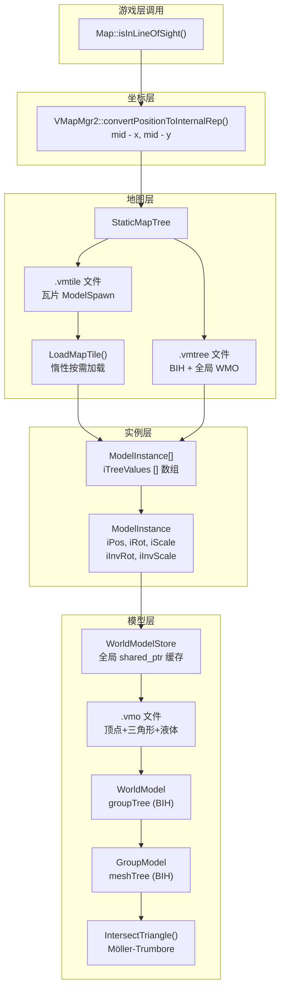

# AzerothCore VMap 静态世界几何系统详解

> **相关文档**: [架构总览](./ARCHITECTURE.md) · [碰撞检测系统](./COLLISION_SYSTEM.md)
> **分析日期**: 2026-05-27

---

## 快速索引

- **[1. 总体架构](#1-总体架构)**
- **[2. `.vmtree` 文件二进制格式](#2-vmtree-文件二进制格式)**
  - [2.1 Section 1: 文件头](#21-section-1-文件头)
  - [2.2 Section 2: NODE 块 — BIH 树](#22-section-2-node-块--bih-树)
  - [2.3 BIH 序列化格式](#23-bih-序列化格式)
  - [2.4 Section 3: GOBJ 块 — 全局生成点](#24-section-3-gobj-块--全局生成点)
  - [2.5 InitMap 解析算法](#25-initmap-解析算法)
- **[3. `.vmtile` 文件二进制格式](#3-vmtile-文件二进制格式)**
  - [3.1 文件头](#31-文件头)
  - [3.2 ModelSpawn 结构](#32-modelspawn-结构)
  - [3.3 Tree Node Reference](#33-tree-node-reference)
  - [3.4 LoadMapTile 解析算法](#34-loadmaptile-解析算法)
- **[4. `.vmo` 文件二进制格式](#4-vmo-文件二进制格式)**
  - [4.1 整体布局](#41-整体布局)
  - [4.2 GroupModel 内部子块](#42-groupmodel-内部子块)
  - [4.3 WmoLiquid 液体数据](#43-wmoliquid-液体数据)
  - [4.4 液体高度双线性插值](#44-液体高度双线性插值)
- **[5. 瓦片坐标系统](#5-瓦片坐标系统)**
  - [5.1 坐标常量与编码](#51-坐标常量与编码)
  - [5.2 坐标变换](#52-坐标变换)
  - [5.3 全局生成点的哨兵坐标](#53-全局生成点的哨兵坐标)
- **[6. ModelInstance 空间变换](#6-modelinstance-空间变换)**
  - [6.1 构造函数](#61-构造函数)
  - [6.2 光线求交流程](#62-光线求交流程)
- **[7. WorldModelStore 全局缓存](#7-worldmodelstore-全局缓存)**
- **[8. 碰撞查询的回调架构](#8-碰撞查询的回调架构)**
  - [8.1 光线查询 (isInLineOfSight)](#81-光线查询-isinlineofsight)
  - [8.2 高度查询 (getHeight)](#82-高度查询-getheight)
  - [8.3 命中位置查询 (GetObjectHitPos)](#83-命中位置查询-getobjecthitpos)
  - [8.4 区域信息查询 (GetLocationInfo)](#84-区域信息查询-getlocationinfo)
- **[9. 完整视线检测数据流](#9-完整视线检测数据流)**
- **[10. E2E 数据流图 (Mermaid)](#10-e2e-数据流图-mermaid)**
- **[11. 关键性能优化](#11-关键性能优化)**
- **[12. 核心文件索引](#12-核心文件索引)**

---

## 1. 总体架构

VMap 是 AzerothCore 中用于**静态世界几何**（建筑、地形装饰物、WMO/M2 模型）碰撞检测的系统。它是一个分层、惰性加载的架构，由三个二进制文件格式和一个全局模型缓存组成。

```
VMapMgr2 (全局单例)
  │  坐标变换 + 文件定位
  │
  └── StaticMapTree (每张地图一个)
        │  顶层 BIH → 索引 ModelInstance 数组
        │
        ├── .vmtree 文件 → 地图级 BIH + 全局 WMO (实例地图)
        ├── .vmtile 文件 → 按需加载的瓦片内 ModelSpawn 数据
        └── WorldModelStore (全局单例缓存)
              └── .vmo 文件 → WorldModel → GroupModel[](含 BIH+顶点+三角形+液体)
```

**三文件体系**:

| 文件 | 包含内容 | 何时加载 |
|------|---------|---------|
| `{mapId:03d}.vmtree` | 地图级 BIH 树 + (非瓦片地图)单个全局 WMO 生成点 | 地图初始化时 |
| `{mapId:03d}_{tileY:02d}_{tileX:02d}.vmtile` | 某瓦片内所有模型生成点 + BIH 节点引用 | 玩家接近该瓦片时 |
| `{name}.vmo` | 一个模型的全部碰撞几何 (顶点/三角形/液体) | 首次被引用时, 全局缓存 |

---

## 2. `.vmtree` 文件二进制格式

以 `001.vmtree` 为例 (地图 ID 1), 其解析入口为 `StaticMapTree::InitMap` (`MapTree.cpp:263-311`)。

### 2.1 Section 1: 文件头

| 偏移 | 大小 | 类型 | 字段 | 说明 |
|------|------|------|------|------|
| `0x00` | 8 字节 | `char[8]` | magic | 恒为 `"VMAP_4.8"` |
| `0x08` | 1 字节 | `char` | tiled | `0` = 非瓦片 (实例地图), `1` = 瓦片 (世界地图) |

**解析代码** (`MapTree.cpp:277-285`):
```cpp
readChunk(rf, chunk, VMAP_MAGIC, 8);  // 验证魔法数字
fread(&tiled, sizeof(char), 1);        // 读 1 字节 tiled 标志
iIsTiled = bool(tiled);
```

> `readChunk` (定义于 `VMapDefinitions.h:30`) 是通用的 "fread + memcmp" 辅助函数: 读 `len` 字节到缓冲区后与 `compare` 比较, 不匹配则返回 false。

### 2.2 Section 2: NODE 块 — BIH 树

| 偏移 | 大小 | 类型 | 字段 |
|------|------|------|------|
| `0x09` | 4 字节 | `char[4]` | chunkId = `"NODE"` |
| `0x0D` | 可变 | BIH 序列化数据 | `tree` — 完整 BIH 树 |

**解析代码** (`MapTree.cpp:278`):
```cpp
bool success = readChunk(rf, chunk, "NODE", 4) && iTree.readFromFile(rf);
iNTreeValues = iTree.primCount();
iTreeValues = new ModelInstance[iNTreeValues];
```

> `iTree.primCount()` 返回 BIH 中存储的基元 (ModelInstance) 数量, 据此分配 `iTreeValues` 数组。

### 2.3 BIH 序列化格式

`BIH::writeToFile` / `BIH::readFromFile` (`BoundingIntervalHierarchy.cpp:273-302`):

| 偏移 | 大小 | 类型 | 字段 |
|------|------|------|------|
| `+0x00` | 12 字节 | `float[3]` | `bounds.low()` |
| `+0x0C` | 12 字节 | `float[3]` | `bounds.high()` |
| `+0x18` | 4 字节 | `uint32` | `treeSize` — 节点数组长度 |
| `+0x1C` | `treeSize × 4` 字节 | `uint32[]` | `tree[]` — BIH 节点数据 |
| 之后 | 4 字节 | `uint32` | `objectCount` — 基元索引数量 |
| 之后 | `objectCount × 4` 字节 | `uint32[]` | `objects[]` — 基元索引数组 |

**读取校验逻辑** (`BoundingIntervalHierarchy.cpp:287-301`):
```cpp
uint32 treeSize, count, check = 0;
check += fread(&lo, sizeof(float), 3, rf);         // 3 reads
check += fread(&hi, sizeof(float), 3, rf);         // 3 reads
bounds = G3D::AABox(lo, hi);
check += fread(&treeSize, sizeof(uint32), 1, rf);  // 1 read
tree.resize(treeSize);
check += fread(&tree[0], sizeof(uint32), treeSize, rf); // treeSize reads
check += fread(&count, sizeof(uint32), 1, rf);     // 1 read
objects.resize(count);
check += fread(&objects[0], sizeof(uint32), count, rf); // count reads
return uint64(check) == uint64(3 + 3 + 1 + 1 + uint64(treeSize) + uint64(count));
```

> 每个 `fread` 返回成功读取的项数, 累加至 `check`。校验等式确保无一遗漏。

### 2.4 Section 3: GOBJ 块 — 全局生成点

| 偏移 | 大小 | 类型 | 字段 |
|------|------|------|------|
| 开头 | 4 字节 | `char[4]` | chunkId = `"GOBJ"` |

**仅当 `tiled == 0` (非瓦片地图, 如副本) 时存在**。包含恰好 **1 个** `ModelSpawn` 记录, 是该地图唯一的全局 WMO 生成点。

**解析代码** (`MapTree.cpp:293-307`):
```cpp
if (!iIsTiled) {
    ModelSpawn spawn;
    ModelSpawn::readFromFile(rf, spawn);
    auto model = sWorldModelStore->AcquireModelInstance(
        iBasePath, spawn.name, spawn.flags);
    iTreeValues[0] = ModelInstance(spawn, model);   // 始终固定放在索引 0
}
```

### 2.5 InitMap 解析算法

`StaticMapTree::InitMap(fname)` 完整流程 (`MapTree.cpp:263-311`):

```
InitMap(fname):
  1. fullname = iBasePath + fname   (e.g. "vmaps/001.vmtree")
  2. rf = fopen(fullname, "rb")
  3. 若非 rf → return false

  4. 读取并验证 magic "VMAP_4.8" (8 字节)
  5. 读取 tiled 标志 (1 字节) → iIsTiled
  6. 读取并验证 chunkId "NODE" (4 字节)
  7. iTree.readFromFile(rf) → 加载 BIH 树
  8. iNTreeValues = iTree.primCount() → 分配 iTreeValues 数组
  9. 尝试读取 chunkId "GOBJ" (4 字节)

  10. 若 !iIsTiled (实例地图):
      读取 1 个 ModelSpawn
      从 WorldModelStore 获取 .vmo 模型
      iTreeValues[0] = ModelInstance(spawn, model)

  11. fclose(rf)
  12. return success
```

---

## 3. `.vmtile` 文件二进制格式

命名规则: `{mapId:03d}_{tileY:02d}_{tileX:02d}.vmtile`, **注意 Y 在 X 之前**。

例如: `001_00_19.vmtile` = 地图 ID 1, 瓦片 X=19, Y=0。

### 3.1 文件头

| 偏移 | 大小 | 类型 | 字段 |
|------|------|------|------|
| `0x00` | 8 字节 | `char[8]` | magic = `"VMAP_4.8"` |
| `0x08` | 4 字节 | `uint32` | `numSpawns` — 此瓦片包含的模型生成点数量 |

### 3.2 ModelSpawn 结构

每个生成点记录按以下顺序读取 (`ModelInstance.cpp:125-171`):

| # | 大小 | 类型 | 字段 | 说明 |
|---|------|------|------|------|
| 1 | 4 字节 | `uint32` | `flags` | `MOD_M2=1`, `MOD_WORLDSPAWN=2`, `MOD_HAS_BOUND=4` |
| 2 | 2 字节 | `uint16` | `adtId` | 瓦片内所属的 ADT 编号 |
| 3 | 4 字节 | `uint32` | `ID` | 唯一生成点标识 |
| 4 | 12 字节 | `float[3]` | `iPos` | 世界空间坐标 (x, y, z) |
| 5 | 12 字节 | `float[3]` | `iRot` | 欧拉角 (yaw, pitch, roll), 单位: **度** |
| 6 | 4 字节 | `float` | `iScale` | 统一缩放因子 |
| 7\* | 24 字节 | `float[6]` | `iBound` | **仅当 `flags & MOD_HAS_BOUND`** — 包围盒 (low.x, low.y, low.z, high.x, high.y, high.z) |
| 8 | 4 字节 | `uint32` | `nameLen` | 模型文件名字符串长度 |
| 9 | `nameLen` 字节 | `char[]` | `name` | 模型文件名, e.g. `"AzerothCapitalCityOrgrimmarGrunt06.m2"` |

> **校验**: `check` 计数器必须 = `17` (有包围盒时, 总计 11 个 `fread` 调用) 或 `11` (无包围盒时)。

**ModelSpawn::readFromFile 核心逻辑**:
```cpp
bool ModelSpawn::readFromFile(FILE* rf, ModelSpawn& spawn) {
    uint32 check = 0;
    check += fread(&spawn.flags,  sizeof(uint32), 1, rf);   // item 1
    if (!check) return false;  // EoF 检测
    check += fread(&spawn.adtId, sizeof(uint16), 1, rf);   // item 2
    check += fread(&spawn.ID,    sizeof(uint32), 1, rf);   // item 3
    check += fread(&spawn.iPos,  sizeof(float),  3, rf);   // items 4-6  (counted as 3)
    check += fread(&spawn.iRot,  sizeof(float),  3, rf);   // items 7-9  (counted as 3)
    check += fread(&spawn.iScale,sizeof(float),  1, rf);   // item 10
    if (spawn.flags & MOD_HAS_BOUND) {
        Vector3 lo, hi;
        check += fread(&lo, sizeof(float), 3, rf);         // items 11-13
        check += fread(&hi, sizeof(float), 3, rf);         // items 14-16
        spawn.iBound = G3D::AABox(lo, hi);
    }
    check += fread(&nameLen, sizeof(uint32), 1, rf);       // item 17 or 11
    if (check != uint32(has_bound ? 17 : 11)) return false; // 校验
    char nameBuff[500];
    fread(nameBuff, sizeof(char), nameLen, rf);            // item 18 or 12
    spawn.name = std::string(nameBuff, nameLen);
    return true;
}
```

### 3.3 Tree Node Reference

紧接在 ModelSpawn 之后, 额外 4 字节:

| 大小 | 类型 | 字段 |
|------|------|------|
| 4 字节 | `uint32` | `referencedVal` — 指向 `iTreeValues[]` 的索引 |

此值由提取工具预计算——它指示这个生成点的 BIH 包围盒在顶层 BIH 树中映射到哪个叶节点, 从而定位到 `iTreeValues` 数组的哪个槽位。

### 3.4 LoadMapTile 解析算法

`StaticMapTree::LoadMapTile(tileX, tileY)` 完整流程 (`MapTree.cpp:322-418`):

```
LoadMapTile(tileX, tileY):
  1. 若 !iIsTiled:
       iLoadedTiles[packTileID(tileX,tileY)] = false  // 标记为"伪加载"
       return true

  2. 若 !iTreeValues: → return false (未初始化)

  3. tilefile = iBasePath + getTileFileName(iMapID, tileX, tileY)
     如: "vmaps/001_19_00.vmtile"

  4. tf = fopen(tilefile, "rb")
     若非 tf: → iLoadedTiles[...] = false → return true (空瓦片正常)

  5. 验证 magic "VMAP_4.8" (8 字节)
  6. 读取 numSpawns (uint32)

  7. 循环 i = 0 → numSpawns-1:
     a. 读取 ModelSpawn → result
        若非 result: break
     b. 加载模型:
        model = sWorldModelStore->AcquireModelInstance(basePath, spawn.name, spawn.flags)
        若非 model: log 错误
     c. 读取 referencedVal (uint32)
     d. 若 referencedVal >= iNTreeValues: 跳过
     e. 若 iTreeValues[referencedVal].getWorldModel() == nullptr:
          iTreeValues[referencedVal] = ModelInstance(spawn, model)
        // ★ "首次写入胜出": 若该槽已填充则跳过 (已有的 ModelInstance 已足够)

  8. iLoadedTiles[packTileID(tileX,tileY)] = true
  9. fclose(tf)
  10.return result
```

**关键设计 — 首次写入胜出**: 当同个 BIH 叶节点被多个生成点引用时, 只有第一个成功填充 `iTreeValues[slot]`。这是因为 BIH 遍历到该叶节点后只需一个 `ModelInstance` 执行碰撞检测, 多个重复已是冗余。

---

## 4. `.vmo` 文件二进制格式

`.vmo` 文件存储单个模型 (WMO 或 M2) 的全部碰撞几何数据。示例文件名: `wmo/Azeroth/Karazhan/Karazhan.wmo.vmo`。

### 4.1 整体布局

| Section | 大小 | 内容 |
|---------|------|------|
| Header | 8 字节 | `"VMAP_4.8"` 魔法数字 |
| Chunk `"WMOD"` | 4B 标签 + 4B 大小 + 4B RootWMOID | 世界模型的根 WMO ID |
| Chunk `"GMOD"` | 4B 标签 + 4B 总数 + N×GroupModel | 所有 GroupModel (子组) 数据 |
| Chunk `"GBIH"` | 4B 标签 + BIH 序列化数据 | 组级 BIH 加速结构 |

**解析顺序** (`WorldModel.cpp:663-701`):
```
readFile(fname):
  1. 验证 "VMAP_4.8" header
  2. 读 "WMOD" chunk → RootWMOID
  3. 读 "GMOD" chunk:
     readGroupModels(rf) → 对每个 GroupModel:
        读 "VERT" → vertices[]
        读 "TRIM" → triangles[]
        读 "MBIH" → meshTree (三角形级 BIH)
        读 "LIQU" → iLiquid (可选液体)
  4. 读 "GBIH" chunk → groupTree (组级 BIH)
  5. return true
```

### 4.2 GroupModel 内部子块

| Sub-chunk | 文件格式 | 内容 |
|-----------|---------|------|
| 固定字段 | 24B AABox + 4B iMogpFlags + 4B iGroupWMOID = 32B | 包围盒 + 标志 + 组标识 |
| `"VERT"` | 4B 标签 + 4B chunkSize + 4B count + N×12B (float×3) | 顶点缓冲 (Vector3 数组) |
| `"TRIM"` | 4B 标签 + 4B chunkSize + 4B count + N×12B (uint32×3) | 索引缓冲 (MeshTriangle 数组) |
| `"MBIH"` | 4B 标签 + BIH 序列化数据 | 三角形级的 BIH 加速树 |
| `"LIQU"` | 4B 标签 + 4B chunkSize + WmoLiquid 数据 | WMO 液体表面 (可选) |

**相关标志位**:

| 常量 | 值 | 含义 |
|------|-----|------|
| `MOD_M2` | 1 | M2 模型 (生物/装饰物) — 无区域信息, 可被视线排除 |
| `MOD_WORLDSPAWN` | 2 | WMO 世界生成点 (建筑/设施) |
| `MOD_HAS_BOUND` | 4 | 生成点文件包含预计算包围盒 |

`iMogpFlags` (WMO 组标志):
- `0x8` = 室外
- `0x2000` = 室内

### 4.3 WmoLiquid 液体数据

| 字段 | 大小 | 说明 |
|------|------|------|
| `iTilesX` | uint32 | X 方向液体瓦片数 |
| `iTilesY` | uint32 | Y 方向液体瓦片数 |
| `iCorner` | Vector3 (12B) | 左下角世界坐标 |
| `iType` | uint32 | 液体类型 (0=水, 1=岩浆, 2=软泥) |
| `iHeight[]` | `float × (TilesX+1)×(TilesY+1)` | 顶点高度数组 (四角共享) |
| `iFlags[]` | `uint8 × TilesX×TilesY` | 使用标志 (0x0F = 禁用该瓦片) |

### 4.4 液体高度双线性插值

`WmoLiquid::GetLiquidHeight` (`WorldModel.cpp:166-231`):

```
GetLiquidHeight(worldPos):
  1. 检查 pos 是否在液体区域内
  2. tileX = floor((pos.x - corner.x) / LIQUID_TILE_SIZE)
     tileY = floor((pos.y - corner.y) / LIQUID_TILE_SIZE)
     // LIQUID_TILE_SIZE = 533.333 / 128 ≈ 4.167

  3. 获取瓦片四角高度: h00, h10, h01, h11

  4. dx = (pos.x - tileMinX) / TILE_SIZE     (范围 [0, 1])
     dy = (pos.y - tileMinY) / TILE_SIZE     (范围 [0, 1])

  5. 若 dx > dy:  // 取 / 对角线 (左下→右上三角)
       height = h00 + dx*(h10-h00) + dy*(h11-h10)
     否则:          // 取 \ 对角线 (左上→右下三角)
       height = h00 + dx*(h10-h01) + dy*(h01-h00)

  6. 若 iFlags[tileX][tileY] & 0x0F → 禁用 → 返回 G3D::finf()
```

```
瓦片示意:
  h01(0,1) ──────── h11(1,1)
       │ \         / │
       │   \     /   │
       │     \ /     │
       │     / \     │
       │   /     \   │
       │ /         \ │
  h00(0,0) ──────── h10(1,0)

  dx > dy → 左下三角 (/)
  否则 → 右上三角 (\)
```

---

## 5. 瓦片坐标系统

### 5.1 坐标常量与编码

| 常量 | 值 | 含义 |
|------|-----|------|
| `MAX_NUMBER_OF_GRIDS` | 64 | 地图最多 64×64 网格 |
| `SIZE_OF_GRIDS` | 533.3333f | 每个网格世界单位 |
| 地图总尺寸 | 34133.33 | `64 × 533.3333` |

**Tile ID 编解码** (`MapTree.h:70-71`):
```cpp
static uint32 packTileID(uint32 tileX, uint32 tileY)
{
    return tileX << 16 | tileY;        // 高 16 位 = X, 低 16 位 = Y
}

static void unpackTileID(uint32 ID, uint32& tileX, uint32& tileY)
{
    tileX = ID >> 16;
    tileY = ID & 0xFF;                 // 仅取低 8 位 (max 255 > 64)
}
```

**瓦片文件名生成** (`MapTree.cpp:77-85`):
```cpp
std::string getTileFileName(uint32 mapID, uint32 tileX, uint32 tileY)
{
    std::stringstream tilefilename;
    tilefilename.fill('0');
    tilefilename << std::setw(3) << mapID << '_';
    tilefilename << std::setw(2) << tileY << '_'          // ★ Y 在 X 之前
                 << std::setw(2) << tileX << ".vmtile";
    return tilefilename.str();
}
```

> 文件名格式: `{mapId:03d}_{tileY:02d}_{tileX:02d}.vmtile` — **Y 在 X 之前**, 与 packTileID 的高位 (X) 优先不同。

### 5.2 坐标变换

`VMapMgr2::convertPositionToInternalRep` (`VMapMgr2.cpp:41-49`):

```cpp
Vector3 convertPositionToInternalRep(float x, float y, float z)
{
    const float mid = 0.5f * MAX_NUMBER_OF_GRIDS * SIZE_OF_GRIDS;
    // mid = 0.5 * 64 * 533.3333 = 17066.67

    pos.x = mid - x;    // 翻转 X 轴
    pos.y = mid - y;    // 翻转 Y 轴
    pos.z = z;          // Z 轴不变

    return pos;
}
```

此变换将**客户端坐标系**(地图中心为原点)映射到**内部坐标系**(地图左下角为原点), 因为 BIH 树中的所有包围盒均以内部坐标系存储。

### 5.3 全局生成点的哨兵坐标

提取工具 (TileAssembler) 对**非瓦片地图** (实例地图, 如卡拉赞) 的生成点使用哨兵瓦片坐标 **(65, 65)**, 超出正常 0-63 范围。

由此种生成点产生的数据不写入 `.vmtile` 文件, 而是直接嵌入 `.vmtree` 文件末尾的 GOBJ 块中 (`TileAssembler.cpp:135`):
```cpp
// 提取工具跳过正常的瓦片路由
if (tileX == 65 && tileY == 65) {
    // 直接写入 .vmtree 的 GOBJ 块
}
```

---

## 6. ModelInstance 空间变换

`ModelInstance` (`Models/ModelInstance.h:63-76`) 是物体在世界空间的最外层"实例包装"。同一个 `WorldModel` 可被多个 `ModelInstance` 在不同位置/旋转/缩放引用。

### 6.1 构造函数

`ModelInstance.cpp:27-31`:

```cpp
ModelInstance::ModelInstance(const ModelSpawn& spawn, shared_ptr<WorldModel> model)
    : ModelSpawn(spawn), iModel(model)
{
    iInvRot = G3D::Matrix3::fromEulerAnglesZYX(
        G3D::pi() * iRot.y / 180.f,    // Yaw   (绕 Z 轴)
        G3D::pi() * iRot.x / 180.f,    // Pitch (绕 X 轴)
        G3D::pi() * iRot.z / 180.f     // Roll  (绕 Y 轴)
    ).inverse();

    iInvScale = 1.f / iScale;
}
```

**关键**: 使用 **ZYX 旋转顺序** (先绕 Z, 再绕 X, 最后绕 Y), 与 WoW 客户端的 WMO 放置变换一致。旋转矩阵被**预计算并求逆**存储, 用于世界空间射线到模型空间的转换。

### 6.2 光线求交流程

`ModelInstance.cpp:33-64`:

```
intersectRay(worldRay, maxDist, stopAtFirstHit, ignoreFlags):
│
├── 1. AABB 早退 (第 40 行):
│     worldRay.intersectionTime(iBound) → 射线穿过实例包围盒?
│     否 → return false (★ 关键性能优化: 绝大多数射线在此被拒绝)
│
├── 2. 射线变换到模型空间 (第 54-56 行):
│     modelOrigin = iInvRot * (worldOrigin - iPos) * iInvScale
│     modelDir    = iInvRot * worldDir         // ★ 只旋转, 不缩放
│     modelDist   = worldDist * iInvScale
│
├── 3. WorldModel::IntersectRay(modelRay, modelDist, ...):
│     ├── MOD_M2 + ignoreFlags.M2? → 跳过整个模型
│     ├── groupTree.intersectRay() → 组级 BIH 遍历
│     ├── GroupModel::IntersectRay() → meshTree.intersectRay() → 三角形级 BIH
│     └── ::IntersectTriangle() → Möller-Trumbore 三角形求交
│
└── 4. 命中距离缩放回世界空间 (第 60 行):
      worldDist = modelDist * iScale
```

**关键要点**:
- **方向不缩放**: `modelDir` 仅旋转不缩放, 因为缩放会改变单位向量的长度, 破坏距离参数 t 的计算
- **位置三部逆变换**: `旋转(逆) → 平移(原点) → 缩放(逆)` — 将世界空间射线变回模型局部空间
- **距离双缩放**: 进入时 `× iInvScale`, 命中后 `× iScale` — 在模型空间中计算, 世界空间中返回

---

## 7. WorldModelStore 全局缓存

`WorldModelStore` (`Management/WorldModelStore.h/.cpp`) 是一个**线程安全的全局模型缓存**。

```cpp
class WorldModelStore {
    std::unordered_map<std::string, std::shared_ptr<WorldModel>> _loadedModels;
    std::mutex _lock;

    static WorldModelStore* instance();  // Meyer's Singleton

    std::shared_ptr<WorldModel> AcquireModelInstance(
        const std::string& basepath,
        const std::string& filename,
        uint32 flags);
};
```

**获取模型流程** (`WorldModelStore.cpp:21-43`):

```
AcquireModelInstance(basePath, filename, flags):
│
├── 1. std::lock_guard<std::mutex> lock(_lock)  // 线程安全
│
├── 2. 查 _loadedModels[filename]:
│     ├── 命中 → return existing shared_ptr (引用计数 +1)
│     │
│     └── 未命中:
│       a. 创建 new WorldModel
│       b. model->readFile(basePath + filename + ".vmo")
│       c. 若加载失败: log 错误, return nullptr
│       d. model->Flags = flags
│       e. _loadedModels[filename] = model (shared_ptr 拷贝)
│       f. return model
```

**缓存语义**:
- **全局单例**: `sWorldModelStore` 宏 (`.h:44`), 一个进程只存在一份
- **文件名作为键**: 同一模型文件 (如 `OrgrimmarGrunt06.m2`) 在多个瓦片/多个地图中被多个 `ModelInstance` 引用时, 仅加载一次 `.vmo`
- **shared_ptr 引用计数**: 最后释放的引用者负责销毁 `WorldModel`, 与瓦片的加载/卸载生命周期解耦
- **flags 仅在首次加载时设置**: 后续查找返回已缓存的模型, 其 Flags 保持不变

---

## 8. 碰撞查询的回调架构

所有查询通过**回调类**在 BIH 遍历时将叶节点索引转换为实际碰撞检测。位于 `MapTree.cpp` 中。

### 8.1 光线查询 (isInLineOfSight)

`MapTree.cpp:129-148`:

```
isInLineOfSight(pos1, pos2, ignoreFlags):
  1. maxDist = distance(pos1, pos2)
  2. 验证 maxDist 非 inf/NaN/< 1e-10
  3. ray = Ray::fromOriginAndDirection(pos1, normalize(pos2-pos1))
  4. return NOT GetIntersectionTime(ray, maxDist, stopAtFirstHit=TRUE, ignoreFlags)
     // 命中 → false (有遮挡), 未命中 → true (视线畅通)
```

**MapRayCallback** (行 35-53):
```
operator()(ray, entry, &dist, stopAtFirst):
  → prims[entry].intersectRay(ray, dist, stopAtFirst, flags)
  → 命中时若 stopAtFirst: 立即停止遍历
```

### 8.2 高度查询 (getHeight)

`MapTree.cpp:201-212`:

```
getHeight(pos, maxSearchDist):
  1. dir = Vector3(0, 0, -1)   // 垂直向下
  2. ray = Ray(pos, dir)
  3. 若 GetIntersectionTime(ray, maxDist, stopAtFirstHit=FALSE, Nothing):
       return pos.z - maxDist   // 从射线起点减去向下距离 = 地面高度
     否则:
       return G3D::finf()       // 未找到地面
```

> `stopAtFirstHit=FALSE` 允许继续查找, 但 `maxDist` 会随命中更新为最近的命中距离。

### 8.3 命中位置查询 (GetObjectHitPos)

`MapTree.cpp:156-197`:

```
GetObjectHitPos(pos1, pos2, &hitPos, modifyDist):
  1. ray = Ray(pos1, normalize(pos2-pos1))
  2. GetIntersectionTime(ray, maxDist, TRUE, ignoreFlags)
  3. 若命中:
       hitPos = pos1 + rayDir * maxDist     // 碰撞点
       若 modifyDist < 0:                    // 向后退
         若 distance(pos1→hitPos) > -modifyDist: hitPos += dir * modifyDist
         否则: hitPos = pos1
       若 modifyDist > 0:                    // 向前移
         hitPos += dir * modifyDist
       return true
     否则:
       hitPos = pos2                         // 兜底: 返回终点
       return false
```

### 8.4 区域信息查询 (GetLocationInfo)

`MapTree.cpp:87-92`:

```
GetLocationInfo(pos, info):
  1. LocationInfoCallback cb(iTreeValues, info)
  2. iTree.intersectPoint(pos, cb)        // ★ 使用 BIH 点查询 (非光线)
  3. return cb.result
```

**LocationInfoCallback** (行 55-73):
```
operator()(point, entry):
  → prims[entry].GetLocationInfo(point, locInfo)
```

`ModelInstance::GetLocationInfo` (`ModelInstance.cpp:66-108`):

```
GetLocationInfo(worldPos, info):
  1. 若 ModelFlags & MOD_M2: return   // M2 无区域信息
  2. 若 point 不在 iBound 内: return
  3. modelPoint = transform(worldPos) → 模型空间
  4. iModel->GetLocationInfo(modelPoint, zDirModel, zDist, groupInfo):
       用向下射线找哪个 GroupModel 包含该点
       返回 groupInfo (MOGP flags, WMO ID)
  5. 变换地面 Z 回世界空间: worldZ = (modelGround * iInvRot).z * iScale + iPos.z
  6. 若 worldZ > info.ground_Z: 更新 info  (★ 取最高地面)
```

---

## 9. 完整视线检测数据流

```
游戏代码调用 Map::isInLineOfSight(pos1, pos2)

  ├── ① VMapMgr2::convertPositionToInternalRep(pos1)
  │     → (mid - x, mid - y, z)   // 客户端坐标 → 内部坐标
  │
  ├── ② StaticMapTree::isInLineOfSight(pos1, pos2, ignoreFlags)
  │      │
  │      ├── Ray(pos1, normalized_direction)
  │      │
  │      └── iTree.intersectRay(ray, MapRayCallback, maxDist, stopAtFirst=true)
  │            │
  │            ├── BIH 内部节点 → 比较 tf/tb 与 [intervalMin, intervalMax]
  │            │   ├── tf < min && tb > max → 空空间, 跳过整个节点
  │            │   ├── tf < min → 仅远面子节点
  │            │   ├── tb > max → 仅近面子节点
  │            │   └── 两平面都相交 → push 远面, 降入近面
  │            │
  │            └── BIH 叶节点 → objects[offset..offset+count-1] → 基元索引
  │                  │
  │                  └── MapRayCallback(entry):
  │                        prims[entry].intersectRay(ray, dist, TRUE, flags)
  │                          │
  │                          ├── ModelInstance::intersectRay():
  │                          │   ├── AABB 早退: ray.time(iBound) → 否? return
  │                          │   ├── 变换: modelRay = transform(worldRay)
  │                          │   └── WorldModel::IntersectRay():
  │                          │         ├── MOD_M2 + ignoreFlags? → skip
  │                          │         └── groupTree.intersectRay():
  │                          │               │
  │                          │               └── GroupModel::IntersectRay():
  │                          │                     └── meshTree.intersectRay():
  │                          │                           │
  │                          │                           └── ::IntersectTriangle():
  │                          │                                 若命中: dist = t, return
  │                          │
  │                          └── stopAtFirst=true: 命中立即停止遍历
  │
  └── 返回: 未命中 → true (视线畅通)
            命中   → false (有遮挡)
```

整个链路涉及 **4 层 BIH 树 + 1 层三角形求交**:
1. `StaticMapTree::iTree` — 索引 `ModelInstance` (叶节点 ≤3 个实例)
2. `WorldModel::groupTree` — 索引 `GroupModel` (叶节点 = 1 个组)
3. `GroupModel::meshTree` — 索引 `MeshTriangle` (叶节点 ≤3 个三角形)
4. `BIHWrap (动态)` — 索引 `GameObjectModel` (用于动态对象, 另见碰撞检测文档)
5. `IntersectTriangle()` — Möller-Trumbore 算法, 真正检测射线-三角形相交

---

## 10. E2E 数据流图 (Mermaid)



---

## 11. 关键性能优化

| 优化策略 | 实现位置 | 效果 |
|---------|---------|------|
| **AABB 早退** | `ModelInstance.cpp:40` | 绝大多数射线在空间变换前即被快速拒绝, 避免昂贵的矩阵乘法 |
| **预计算逆变换** | `ModelInstance.cpp:27-31` | `iInvRot` / `iInvScale` 在构造时计算, 运行时零开销 |
| **方向向量不缩放** | `ModelInstance.cpp:55` | 仅旋转不缩放, 保持单位长度, 保证距离参数 t 正确 |
| **BIH 空空间跳跃** | `BoundingIntervalHierarchy.h` | `tf < min && tb > max` 时直接跳过整个节点, 接近 O(log n) |
| **编码头合并** | `BoundingIntervalHierarchy.h:430` | 轴/叶节点/BVH2 标志/偏移 合并为一个 uint32, 避免额外分支 |
| **方向符号→子节点顺序** | `BIH` 预处理 | `offsetFront = sign(dir[i])`, 射线方向决定先近后远 |
| **BIH 预构建+序列化** | 提取工具 | 构建发生在提取时, 运行时直接二进制反序列化, 零构建开销 |
| **WorldModelStore 缓存** | `WorldModelStore` | `shared_ptr` 引用计数, 同名模型多引用共享一份内存 |
| **瓦片惰性加载** | `LoadMapTile` | 仅加载玩家视野附近的瓦片, 非瓦片地图全量加载 |
| **首次写入胜出** | `LoadMapTile:382-384` | 同一 BIH 叶节点重复引用时跳过重复加载, 节省内存和 I/O |
| **父地图共享** | `MapCollisionData.cpp:34-49` | 实例地图的 VMap/NavMesh 共享基础地图的, 避免重复加载 |

---

## 12. 核心文件索引

| 文件路径 | 职责 | 关键行 |
|---------|------|--------|
| `src/common/Collision/VMapDefinitions.h` | 魔法数字, 文件扩展名定义 | 25-44 |
| `src/common/Collision/Management/VMapMgr2.h` | VMapMgr2 类声明 + DisableTypes | 25-82 |
| `src/common/Collision/Management/VMapMgr2.cpp` | 坐标变换, 文件定位 | 31-65 |
| `src/common/Collision/Management/VMapFactory.h` | 全局单例工厂 | 26-32 |
| `src/common/Collision/Management/VMapFactory.cpp` | 惰性初始化 gVMapMgr | 22-43 |
| `src/common/Collision/Management/IVMapMgr.h` | 抽象接口, AreaAndLiquidData | 36-116 |
| `src/common/Collision/Management/WorldModelStore.h` | shared_ptr 模型缓存单例 | 1-46 |
| `src/common/Collision/Management/WorldModelStore.cpp` | AcquireModelInstance 实现 | 21-43 |
| `src/common/Collision/Maps/MapTree.h` | StaticMapTree 类, packTileID | 48-89 |
| `src/common/Collision/Maps/MapTree.cpp` | InitMap, LoadMapTile, 查询实现 | 129-418 |
| `src/common/Collision/Models/ModelInstance.h` | ModelSpawn + ModelInstance 声明 | 35-76 |
| `src/common/Collision/Models/ModelInstance.cpp` | readFromFile, 构造, intersectRay, GetLocationInfo | 27-171 |
| `src/common/Collision/Models/WorldModel.h` | WorldModel + GroupModel + WmoLiquid 声明 | 35-124 |
| `src/common/Collision/Models/WorldModel.cpp` | readFile, IntersectRay, GetLiquidHeight, GetLocationInfo, IntersectTriangle | 34-701 |
| `src/common/Collision/Models/ModelIgnoreFlags.h` | ModelIgnoreFlags 枚举 (M2 跳过) | 25-29 |
| `src/common/Collision/Maps/MapDefines.h` | MAX_NUMBER_OF_GRIDS, SIZE_OF_GRIDS, MMAP 常量 | 24-76 |
| `src/common/Collision/BoundingIntervalHierarchy.h` | BIH 光线/点查询, 节点编码 | 122-430 |
| `src/common/Collision/BoundingIntervalHierarchy.cpp` | BIH 构建 + 序列化 | 41-302 |
| `src/server/game/Maps/MapCollisionData.h` | MapCollisionData (三层碰撞包装器) | 34-98 |
| `src/server/game/Maps/MapCollisionData.cpp` | 静态 VMap 数据初始化, 父地图共享 | 34-182 |
| `src/common/Collision/Maps/TileAssembler.h/cpp` | 提取工具: 生成 .vmtree / .vmtile 文件 | - |

---

*文档生成日期: 2026-05-27 | 基于仓库 `master` 分支最新代码分析*
